# 具身智能数据合成方法 · 工程案例库

> **仓库**：[github.com/wangyukai0908/embodied-data-synthesis](https://github.com/wangyukai0908/embodied-data-synthesis)  
> **主文（连贯叙述 + 配图）**：[docs/具身智能数据合成方法.md](docs/具身智能数据合成方法.md)  
> **完整 PPT 文稿（44 页最终内容源）**：[docs/presentation-source.md](docs/presentation-source.md)
> **调研长文**：[docs/research-survey.md](docs/research-survey.md)  
> **方法横向比较**：[docs/method-comparison.md](docs/method-comparison.md) · **IDM/WAM 接口说明**：[docs/idm-wam-interface.md](docs/idm-wam-interface.md)
> **实验交接**：[docs/experiment-handoff.md](docs/experiment-handoff.md) · **部署说明**：[docs/vla-wam-deployment.md](docs/vla-wam-deployment.md)
> **上传审计**：[docs/upload-audit.md](docs/upload-audit.md)
> **大文件（视频 / LeRobot / 指标）**：[kevin0908/embodied-data-synthesis-artifacts](https://huggingface.co/datasets/kevin0908/embodied-data-synthesis-artifacts)（说明见 [docs/HF_UPLOAD.md](docs/HF_UPLOAD.md)）

---

## 项目定位

本仓库不是又一个上游模型 monorepo，而是一份**可复核的研究 / 工程案例库**：

| 本仓库是什么 | 本仓库不是什么 |
|---|---|
| 公司汇报《具身智能数据合成方法》的**内容源 + 可运行编排** | NVIDIA / Cosmos / GR00T 上游代码的完整镜像 |
| 两条已跑通链路的参数化脚本、补丁、证据边界与清单 | 权重、完整 126 视频、150G checkpoint 的 Git 托管处 |
| 讲清「合成的是轨迹契约，不是堆视频」 | 宣称策略成功率已提升或真机泛化已验证 |

**一句话主张（与最终版 PPT 一致）：**  
具身智能数据合成不是简单增加视频数量，而是围绕**视觉、状态、语言、动作、时间**五类数据契约，补齐真实数据的覆盖、监督与成本缺口，并最终通过 VLA / WAM 的下游控制效果验收。

**两条已验证工程路径：**

1. **DreamGen（无动作视频）→ IDM 伪动作 → LeRobot → GR00T 微调**  
2. **Cosmos 动作条件：真实 Bridge action → 未来视频**（不经 IDM）

---

## 资源地址

| 资源 | 地址 | 状态 |
|---|---|---|
| 代码与文档 | https://github.com/wangyukai0908/embodied-data-synthesis | 已推送 |
| 大文件 Dataset | https://huggingface.co/datasets/kevin0908/embodied-data-synthesis-artifacts | Bridge test/13、126 MP4、`.data_idm`、`trainer_state.json`（约 235MB；HF 账号与 GitHub 账号为同一项目的 artifact 发布账号） |
| 私有模型仓库（待上传） | `HF_MODEL_REPO`（默认 `wangyukai0908/embodied-data-synthesis-checkpoints`） | GR00T 20k 训练目录和经许可的模型文件；使用 `scripts/upload_remote_artifacts.sh` |
| 主文（连贯叙述） | [`docs/具身智能数据合成方法.md`](docs/具身智能数据合成方法.md) | 配图在 `docs/assets/` |
| PPT 逐页正文 | [`docs/presentation-source.md`](docs/presentation-source.md) | PPTX 二进制不进 Git |
| 流程图 | [`evidence/flowcharts/`](evidence/flowcharts/) | Mermaid + PNG |

### 官方权重 / 上游代码（服务器上有、本仓不托管）

大 checkpoint 请直接从官方拉取，不必再上传到本 Dataset：

| 用途 | 官方地址 |
|---|---|
| IDM（GR1）权重 | https://huggingface.co/seonghyeonye/IDM_gr1 |
| GR00T N1-2B 基座 | https://huggingface.co/nvidia/GR00T-N1-2B |
| Cosmos 动作条件 2B | https://huggingface.co/nvidia/Cosmos-Predict2-2B-Sample-Action-Conditioned |
| Cosmos Video2World tokenizer | https://huggingface.co/nvidia/Cosmos-Predict2-2B-Video2World |
| DreamGen / IDM / GR00T 编排代码 | https://github.com/NVIDIA/GR00T-Dreams （pin `ec3881d44545016871997f8e17dd15f1d792e91d`） |
| Cosmos Predict2 | https://github.com/nvidia-cosmos/cosmos-predict2 （pin `661da4774b0ca41d082a0ecbeb47550bcf07e03f`） |

本仓案例产物（126 视频、`.data_idm`、Bridge 冒烟样本）在 HF Dataset。GR00T 20k 训练目录和其他权重的上传脚本默认创建私有 Model 仓库；第三方权重只有在确认许可并显式设置 `HF_ALLOW_THIRD_PARTY_WEIGHTS=1` 后才会上传，缓存默认永不上传。

---

## 正文

## Part 1：问题定义与产业链位置

真实机器人数据同时受采集成本、设备数量、操作者经验和安全约束限制。一个任务可能只在少量房间、少量物体和单一本体上被反复记录，却很难覆盖长尾物体、遮挡、光照变化、罕见失败和跨机器人形态。数据合成因此不是替代真实数据，而是把真实数据中的控制结构扩展到更大的分布。

### 合成的对象是可训练轨迹

一段视频只能说明“画面发生了变化”，不能自动说明机器人执行了什么动作。可训练的具身轨迹至少要同时满足视觉、状态、语言、动作和时间五类契约：视觉描述环境与交互，状态描述本体自身，语言描述任务意图，动作定义策略要输出的控制量，时间把所有模态绑定到同一 episode 和控制频率。

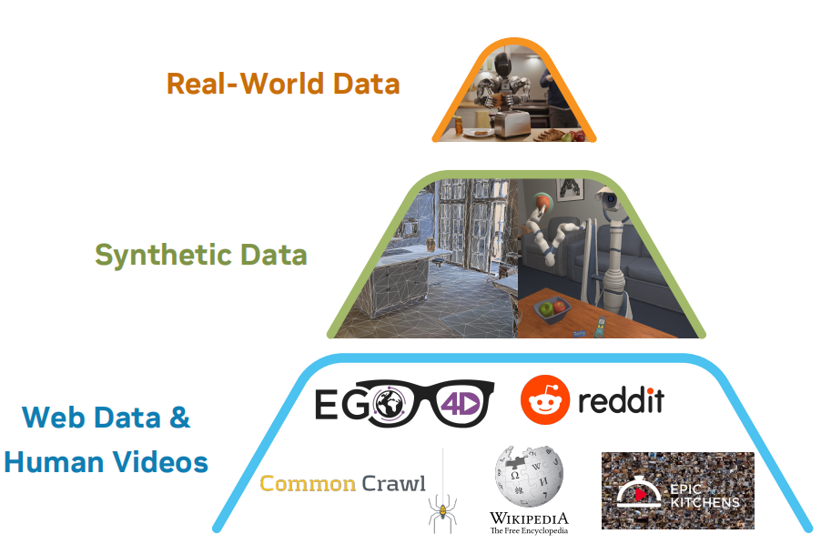
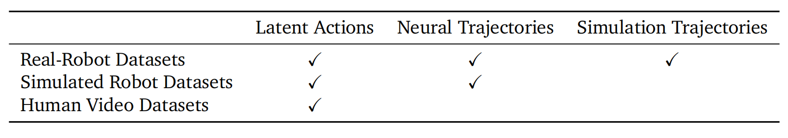

真实数据仍然是物理和控制分布的锚点，但采集、标注、复现都昂贵；合成数据适合定向补充规模、变化和长尾，却必须通过动作一致性、字段完整性和下游训练质量门。只有通过验收的合成轨迹，才值得进入 VLA 训练集。

### 数据合成在产业链的中间位置

产业链可以看成一条闭环：机器人与传感器产生原始观测，遥操作或规划器产生示范，数据工程完成清洗、格式化和统计，数据合成扩展覆盖，随后进入 VLA 或世界模型训练，再经过仿真和真机验证；失败样本会反向指导新的采集与合成。数据合成位于数据工程和模型训练之间，但评价标准来自最终部署，而不是只来自生成器本身。

GR00T 将真实世界数据、合成数据、人类视频和 Neural Trajectories 视为不同来源。它们在动作监督、本体、坐标系和 schema 上并不天然兼容，因此合成流程需要把覆盖扩展重新带回统一的数据契约，而不是简单堆叠样本。

## Part 2：一条可训练的具身轨迹

具身数据不是“一段 MP4”，而是按时间对齐的多模态记录。视觉可以包括 RGB、深度、分割、点云和多视角；状态可以包括关节位置、速度、力矩、末端位姿、夹爪、底盘和人体状态；语言包括任务指令、步骤描述和目标状态；动作可以是关节、末端、夹爪、全身或移动底盘控制；时间字段包括 frame index、timestamp、episode、采样频率和动作 chunk。

不同机器人中 action 的含义不同。单臂常见为末端 6D 位姿加夹爪，或逐关节 position/velocity/torque；双臂需要分别表示左右臂并保持同步；移动操作还要加入底盘线速度和角速度；人形机器人需要同时描述双臂、躯干、头部、腿和手指等高维自由度。坐标系、控制频率、归一化统计量和 embodiment tag 必须一起保存，否则同一个数值在不同本体上可能代表完全不同的动作。

### 文件格式如何承载轨迹

LeRobot 数据格式中，MP4 保存观察画面，Parquet 保存状态、动作和时间索引，元数据定义任务、本体、字段映射、相机信息和归一化统计量。它们共同组成可被 DataLoader 读取的 episode；缺少任一部分，都可能让训练只能看到图像，或无法把预测动作还原为真实控制接口。

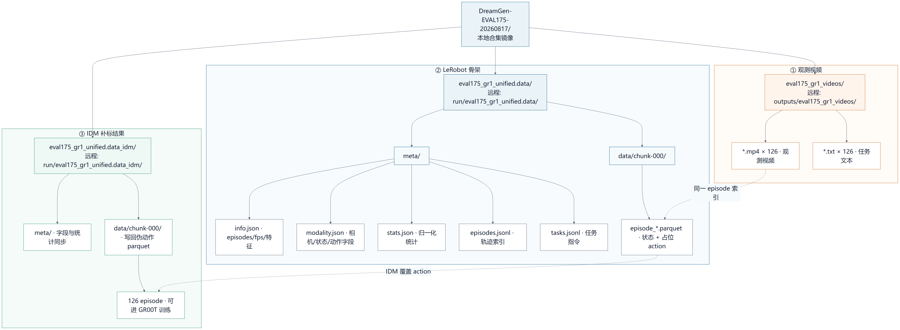

## Part 3：具身智能数据合成的方法谱系

比较方法时，同时看三个维度：环境是真实还是仿真，生成对象是画面、轨迹还是动作标签，动作监督来自真实控制、规划器、重定向估计还是模型伪标签。这样可以避免把“视频逼真”误认为“能够直接训练策略”。

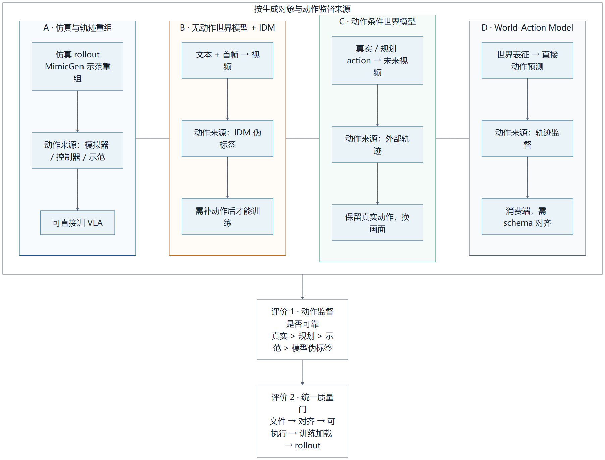
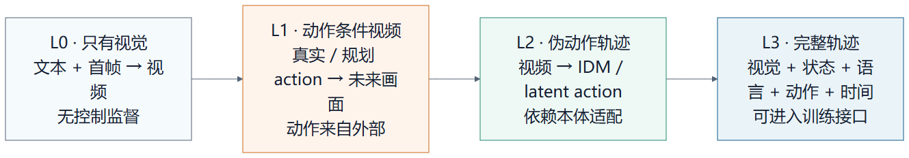

### 仿真与程序化生成

Isaac Lab、MuJoCo、SAPIEN、RoboCasa、LIBERO 和 RoboSuite 可以从环境、任务和机器人配置出发，由脚本、规划器或专家策略 rollout，同时生成画面、状态和动作。域随机化能够快速扩大场景规模，动作监督也天然与仿真状态一致。主要风险是 sim2real gap、接触建模和视觉真实性不足，验收要看任务成功率、碰撞率、动作可执行性和真机迁移表现。

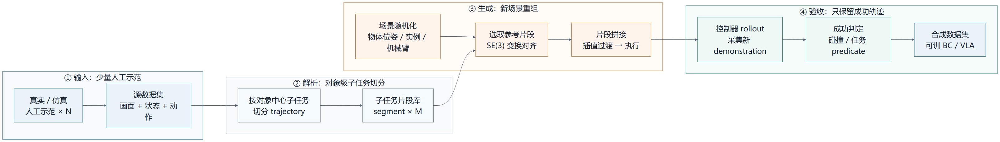

### 真实轨迹重组与示范扩增

MimicGen 把一条真实或仿真示范切分为可复用的子任务，再依据对象相对位姿在新场景中变换、拼接和回放。输出仍然是带状态和动作的完整轨迹，监督来自原示范的重定向，因此通常可以直接进入 VLA。回放失败、碰撞、物体穿透或时序断裂必须筛除；覆盖空间受原始示范和重定向质量限制。

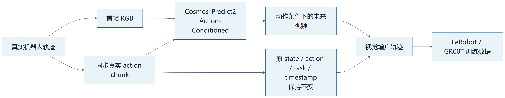

### 人类视频与互联网视频转具身数据

这类方法从人类或互联网视频中做姿态估计、对象跟踪、3D/接触推断，再通过 retargeting、优化和语言步骤补全生成机器人候选轨迹。它能带来远大于机器人日志的任务与场景覆盖，但遮挡会造成姿态歧义，人的动作空间也不等价于机器人的控制空间。候选轨迹必须在仿真或真机中回放，检查碰撞、可达性、接触和任务结果。

### 无动作条件的视频世界模型

DreamGen 等文本/首帧到视频模型回答的是“接下来可能发生什么”。输入通常是任务文本、首帧和初始场景，输出是视觉未来，不直接产生关节动作。它适合扩展视觉变化和长尾环境，但动作监督缺失；若要用于 VLA，必须额外使用 IDM 或其他逆动力学模型从视频补伪标签。因此生成视频本身不能等价为完整机器人轨迹。

### 动作条件的视频世界模型

动作条件模型回答的是“执行这组动作后会看到什么”。输入为首帧和真实或规划 action，Action Conditioner 将动作注入 Cosmos Predict2，输出未来视频；动作监督来自外部控制序列，而不是模型从视频中猜出来。评价重点是动作遵循、物体运动、接触关系和长时一致性。它能保持控制意图，但仍需检查视频是否忠实反映动作。

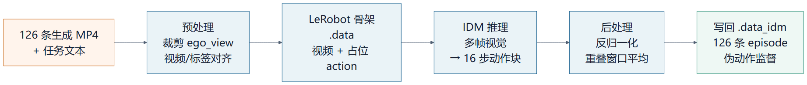

## Part 4：从生成视频到 VLA 的工程验证

### DreamGen：IDM 把视觉变化转回动作

DreamGen 链路以首帧和任务指令生成视频，再由 IDM 接收多时刻视觉条件和 embodiment 信息，预测 16-step action chunk。后处理包括反归一化、字段恢复和滑动窗口平均，最后把动作写回 LeRobot episode。这里的动作是模型伪标签，不是真实控制日志，所以需要单独验证本体适配、动作范围、平滑性以及动作与视觉变化的一致性。

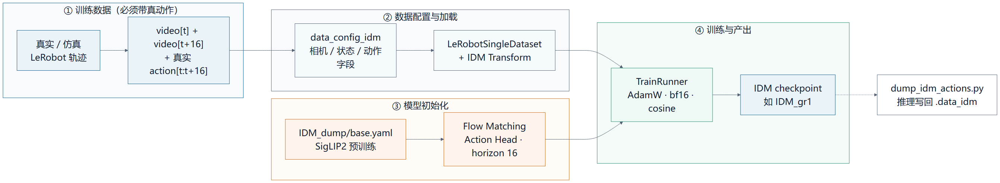
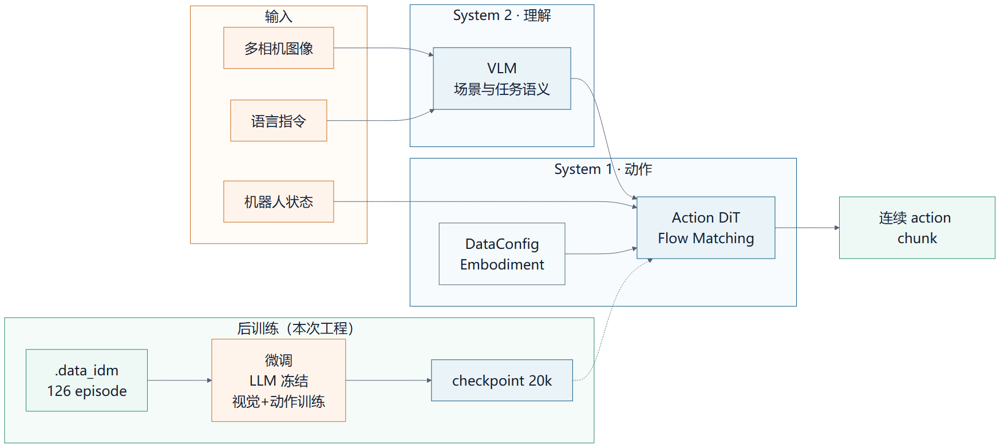
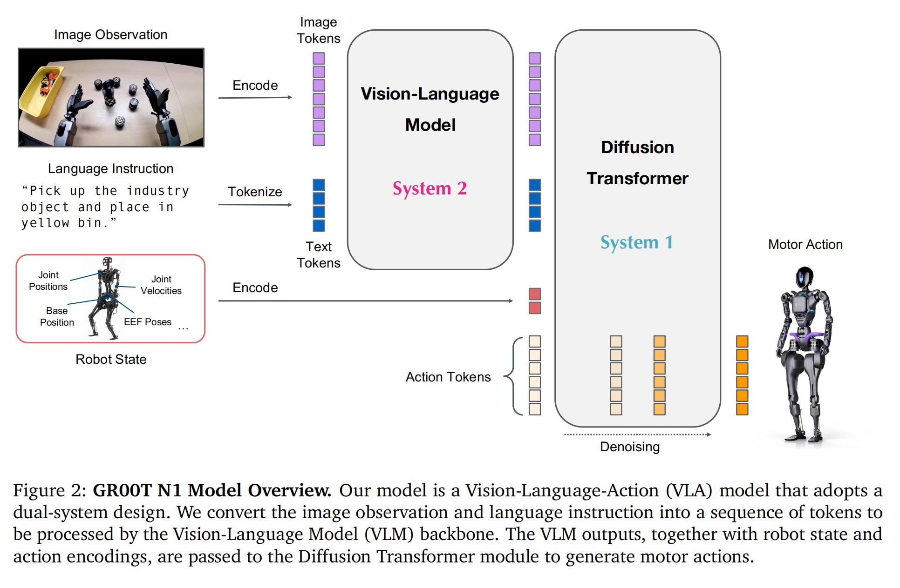

工程闭环可以概括为：首帧与指令 → Cosmos/DreamGen 视频 → IDM 伪动作 → LeRobot 轨迹 → GR00T 数据加载与微调。五类契约必须贯通到训练加载，单纯增加视频数并不能证明数据价值。

### GR00T：VLA 如何消费轨迹

GR00T N1 将视觉和语言编码为任务语义，将状态和 embodiment tag 作为动作语义的约束，再由动作头输出可执行的 action chunk。训练样本需要让观测、语言、状态、动作和时间严格对应；推理时模型根据当前观测滚动执行动作块，并持续接收新的观测。

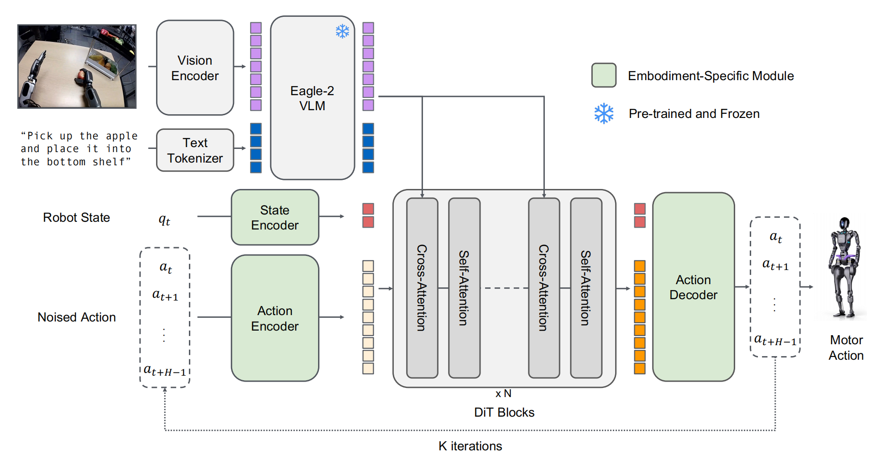
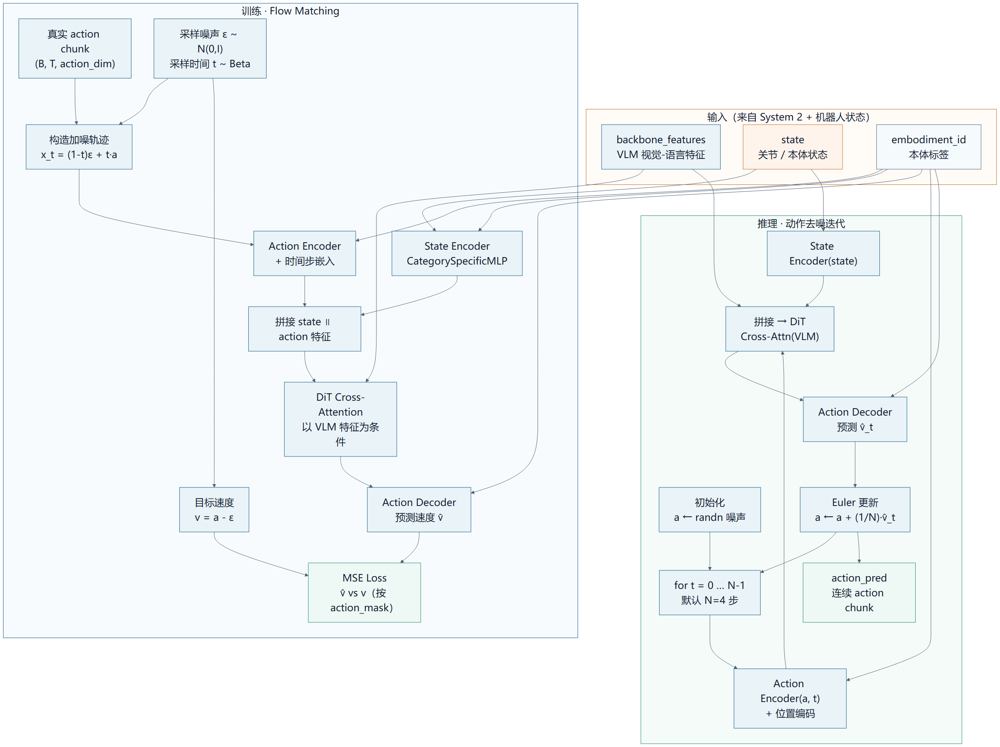

GR00T 的数据层可以混合真实机器人轨迹、仿真轨迹、人类视频和 Neural Trajectories，但每一类数据的监督强度不同。真实轨迹负责校准控制分布，仿真负责结构化规模，生成视频负责扩展视觉覆盖；最终仍要用 rollout 成功率、鲁棒性和泛化评估，而不能只看 loss 或图像质量。

### DreamGen 工程证据

当前工程已贯通“视频生成—动作恢复—轨迹封装—VLA 微调”：`.data_idm` 进入 DataConfig 和 DataLoader，随后由 GR00T-N1-2B 读取。已验证的边界是数据能够完成格式转换、训练加载和梯度更新；尚未证明合成轨迹优于真实或仿真数据，也没有把单条任务结果外推为整体质量结论。

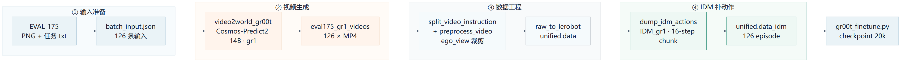
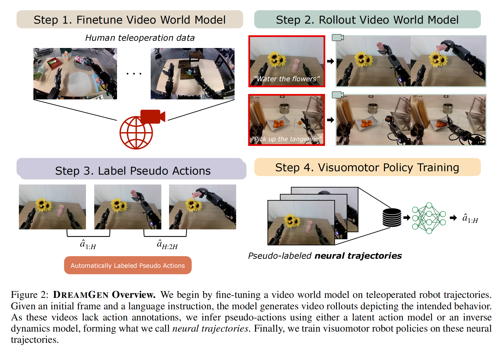
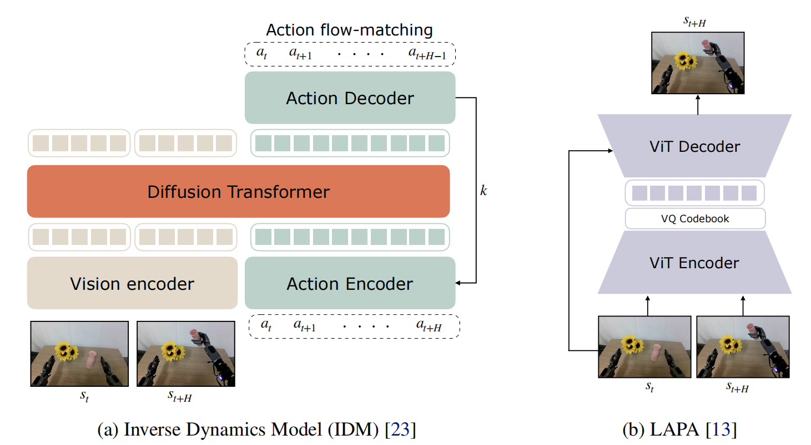
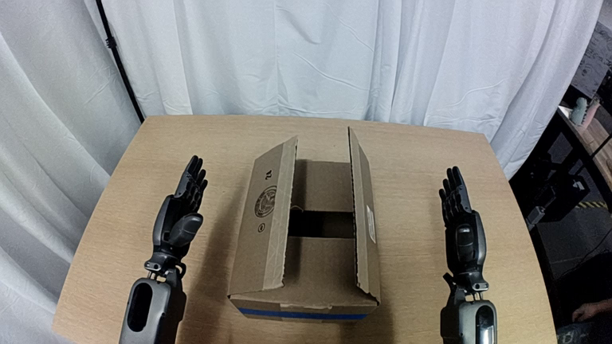
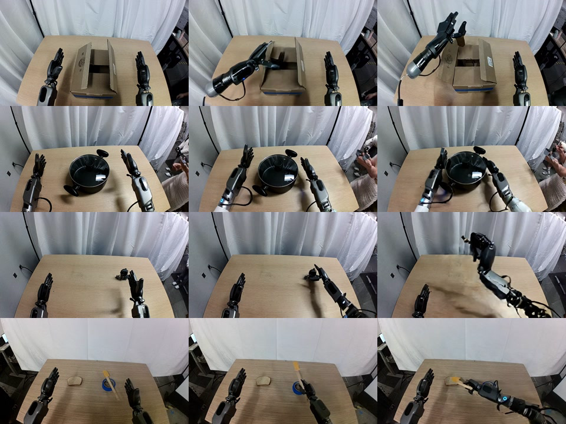

实测记录中，文本条件链路生成了 126 条视频并形成对应 IDM episode；GR00T 训练跑到 20k steps，说明数据可加载、梯度可更新、训练过程可持续。后续必须补充同基线 rollout、任务成功率、鲁棒性和跨场景泛化，不能把 loss 下降当作控制收益。

### Cosmos action-conditioned Bridge

第二条链路直接使用 Bridge test/13 的首帧和真实 action 序列，调用 `Cosmos-Predict2-2B-Sample-Action-Conditioned` 生成未来视频。基础 tokenizer 为 `Cosmos-Predict2-2B-Video2World`，动作来自真实 annotation，不经过 IDM；双卡 A100 已跑通官方推理路径。

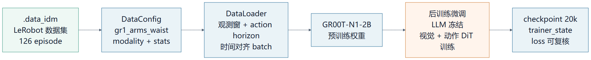
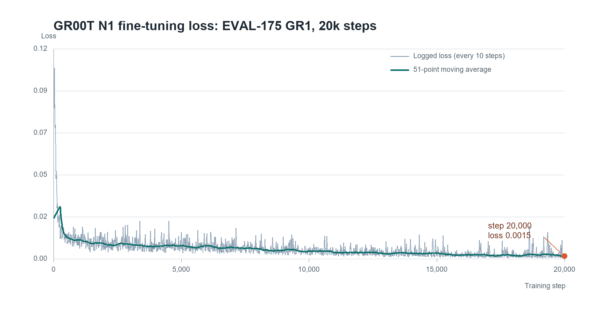
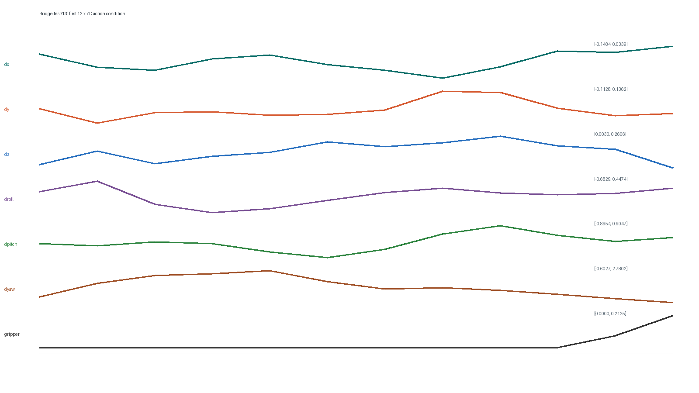
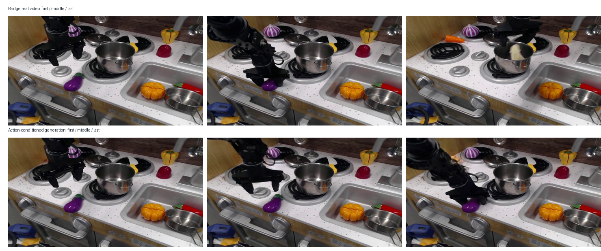

当前样本输入 24 帧、640×480、3 FPS，输出 13 帧、640×480、4 FPS。这个案例证明的是“真实动作条件下的视频生成”接口可以运行，不代表整体数据集质量，也不代表 GR00T、WAM 或真机成功率已经提升。后续展示应同时放首帧、动作曲线、生成关键帧和原始/生成视频对比。

### WAM：动作预测与 IDM 的区别

IDM 的方向是“未来视觉 → 动作”：它为没有动作标签的视频补回伪监督；WAM 的方向是“当前视觉或世界表征 → 动作”：它把视频表征直接解码为控制输出。FastWAM 侧重训练期视频表征、推理期直接动作；LingBot-VA 联合视觉、语言和状态，接口风险集中在状态字段和本体标签；Mimic-Video 使用 Cosmos 特征到动作解码。三者都需要先核对帧数、特征层、动作窗口、统计量和 embodiment schema，再判断 DreamGen 轨迹能否接入。

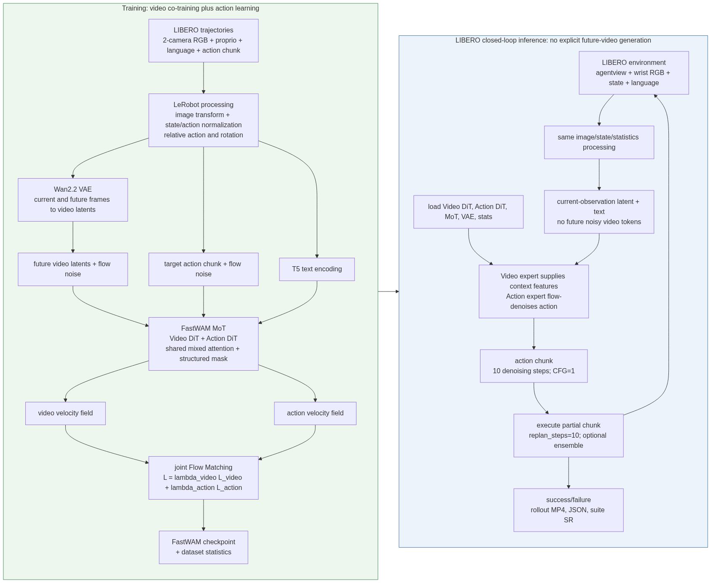
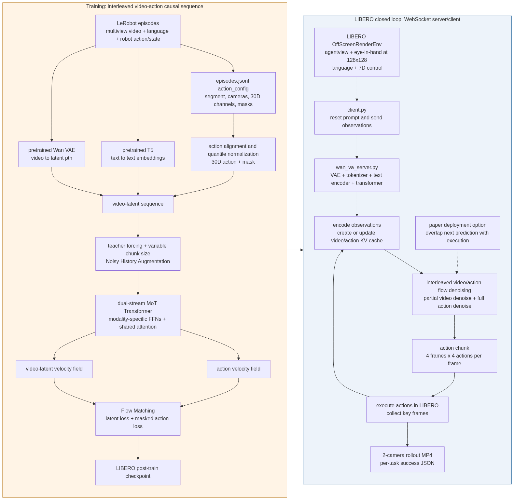
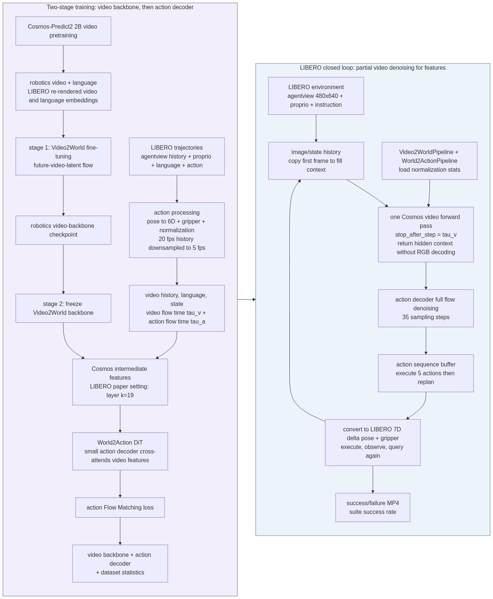

WAM 可以成为合成数据的潜在消费端，但“能读取数据”与“能够从合成数据获益”是两件事。最低限度的验证顺序是：加载 schema → 对齐输入输出维度 → 检查动作误差 → 仿真或真机 rollout → 与真实数据基线比较。

## 方法选择与质量门

| 方法              | 动作监督来源           | 可直接训练 VLA | 主要价值         | 主要风险               |
| ----------------- | ---------------------- | -------------- | ---------------- | ---------------------- |
| 仿真/专家 rollout | 模拟器或控制器         | 是             | 规模与结构化动作 | sim2real gap           |
| MimicGen          | 示范重定向             | 是             | 任务组合         | 回放失败、组合空间有限 |
| 人类视频          | 姿态估计与 retargeting | 条件式         | 场景覆盖         | 控制空间不等价         |
| 无动作世界模型    | 无，需 IDM             | 否             | 视觉未来         | 伪动作质量             |
| 动作条件世界模型  | 真实或规划动作         | 条件式         | 动作—视觉对齐    | 物理一致性             |
| IDM               | 模型伪标签             | 条件式         | 补动作监督       | 误差累积               |
| WAM               | 轨迹监督               | 是             | 直接动作预测     | 接口和本体依赖         |

合成数据至少要通过六道门：文件与解码、视觉一致性、时间对齐、动作与状态合法、训练加载、策略成功率。可读、帧数完整、物体运动连贯、frame/timestamp/episode 对齐、动作不越界且无 NaN、DataLoader 可加载，只说明“数据可用”；真正的“数据有效”还要看 rollout 成功率、鲁棒性和泛化是否达到目标。

## 主流路线与总结

当前主流不是单一模型，而是“真实轨迹为锚点 + 仿真补结构与规模 + 世界模型补视觉与长尾 + 自动质量门 + 下游闭环”。未来重点会转向 action-conditioned world model、数字孪生、跨 embodiment schema、失败驱动生成，以及由 VLA 反向提出数据采集和合成需求。评价也会从画面相似度转向下游控制成功率。

核心结论：合成的是可验证的具身轨迹，不只是视频；完整轨迹至少满足视觉、状态、语言、动作、时间五类契约；方法差异首先在生成对象和动作监督来源，而不是画面是否逼真；最可靠的工程路线是真实锚点、仿真扩结构、世界模型补视觉的混合方案；最终验收应看 rollout 成功率、鲁棒性和泛化，而不是只看 loss 或视频观感。

---

## 手把手教程

### 公共准备

```bash
git clone https://github.com/wangyukai0908/embodied-data-synthesis.git
cd embodied-data-synthesis

# 建议 Linux 或 Windows Git Bash / WSL
bash scripts/qa.sh
```

通过即说明：私有路径扫描、manifest、fixture、metrics、两条 **dry-run** 正常。

上游（真跑 GPU 时再 clone）：

| 用途 | 仓库 | Revision |
|---|---|---|
| DreamGen / IDM / GR00T 脚本 | [NVIDIA GR00T-Dreams](https://github.com/NVIDIA/GR00T-Dreams) | `ec3881d44545016871997f8e17dd15f1d792e91d` |
| Cosmos 动作条件推理 | GR00T-Dreams 内 `cosmos-predict2` 或官方 cosmos-predict2 | `661da4774b0ca41d082a0ecbeb47550bcf07e03f` |

```bash
cd "$UPSTREAM_COSMOS"   # cosmos-predict2 根目录
git checkout 661da4774b0ca41d082a0ecbeb47550bcf07e03f
git apply /path/to/embodied-data-synthesis/patches/cosmos-predict2/*.patch
# 详见 patches/cosmos-predict2/APPLY.md
```

准备环境变量（自行改成你的盘符，**不要**写死他人服务器路径）：

```bash
export DATA_ROOT=...          # EVAL-175 或 HF 下载目录
export CHECKPOINT_ROOT=...    # IDM / Cosmos / GR00T 权重
export OUTPUT_ROOT=...        # 输出
export UPSTREAM_REPO=...      # GR00T-Dreams 根目录
```

---

### 教程 A｜Cosmos Bridge 动作条件（默认冒烟）

**对应 PPT**：Slide 35–36。  
**证明**：动作条件视频生成接口。  
**不证明**：数据集质量、GR1、GR00T 收益。

**A1. Dry-run（无 GPU、无下载）**

```bash
bash pipelines/cosmos_bridge/run_inference.sh \
  --dry-run \
  --input tests/fixtures/bridge_test_13
```

**A2. 真跑（需样本 + 权重）**

1. 从 HF Dataset（上传后）或自备目录准备：
   - `rgb.mp4`
   - `13.json`（Bridge annotation）
2. 准备 checkpoint（官方 HF，见 §2）：
   - `nvidia/Cosmos-Predict2-2B-Sample-Action-Conditioned` → `model-480p-4fps.pt`
   - `nvidia/Cosmos-Predict2-2B-Video2World` → `tokenizer/tokenizer.pth`
3. 应用本仓 2 个 patch（见上）。
4. 在上游执行 `examples/video2world_action.py`（参数见 `pipelines/cosmos_bridge/README.md` 与 `evidence/metrics/bridge_test_13.json`）。
5. 校验：

```bash
python scripts/write_bridge_metrics.py --check evidence/metrics/bridge_test_13.json
```

本仓已有一次实测指标摘要：`evidence/metrics/bridge_test_13.json`（24→13 帧，640×480，4 FPS 输出等）。

---

### 教程 B｜DreamGen → IDM → LeRobot → GR00T

**对应 PPT**：Slide 28–34。  
**证明**：视频生成数量、IDM 写回、训练加载、20k step 接口。  
**不证明**：rollout 成功率。

**B1. Dry-run**

```bash
bash pipelines/dreamgen_gr00t/run_all.sh \
  --dry-run \
  --fixture tests/fixtures/dreamgen
```

**B2. 真跑阶段（均在 `UPSTREAM_REPO` 内，由本仓 launcher 约定路径）**

| 阶段 | 你要得到的产物 | 成功判据 |
|---|---|---|
| generate | `OUTPUT_ROOT/videos/*.mp4` | 数量 = 期望 episode（案例为 126），文件非空可解码 |
| lerobot | `unified.data` | parquet episode 数一致 |
| idm | `unified.data_idm` | 含 `meta/modality.json`，episode 数一致 |
| finetune | `checkpoint-$MAX_STEPS` | 例如 20000；**仅 step 证据** |

```bash
bash pipelines/dreamgen_gr00t/run_all.sh --help
# 真跑需提供 DATA_ROOT / CHECKPOINT_ROOT / OUTPUT_ROOT / UPSTREAM_REPO
# 非空输出目录默认拒绝覆盖；需要时才加 --allow-overwrite
```

画 loss（有 `trainer_state.json` 时）：

```bash
uv run scripts/plot_gr00t_loss.py /path/to/trainer_state.json evidence/plots/gr00t_loss.png
```

---

### 教程 C｜把大文件传到 Hugging Face

见 **[docs/HF_UPLOAD.md](docs/HF_UPLOAD.md)**。推荐优先传：

1. Bridge test/13 输入输出（最小）  
2. DreamGen 126 MP4  
3. `.data_idm`  
4. `trainer_state.json`

远端大文件上传：先在服务器完成 `hf auth login`，再设置 `SERVER_DATA_ROOT`、`HF_TOKEN`，执行 `bash scripts/upload_remote_artifacts.sh`。脚本可重复运行，数据放 Dataset，训练目录和模型放私有 Model 仓库；详细边界见 [上传审计](docs/upload-audit.md)。

辅助脚本（本机材料整理）：

```bash
python scripts/extract_video_keyframes.py /path/to/video.mp4 -o out/ --contact-sheet
python scripts/plot_bridge_action_curve.py tests/fixtures/bridge_test_13/13.json -o evidence/plots/bridge_action.png
uv run scripts/plot_gr00t_loss.py /path/to/trainer_state.json evidence/plots/gr00t_loss.png
```
---

## 仓库结构

```text
docs/
  具身智能数据合成方法.md  # 主文：连贯叙述 + 配图
  assets/                  # 主文引用的 PPT 素材与整页备份
  presentation-source.md   # 最终版 PPT 逐页全文（44 页）
  research-survey.md       # 调研与证据词汇
  method-comparison.md      # 方法统一比较矩阵
  idm-wam-interface.md      # IDM/WAM 接口方向与验收
  experiment-handoff.md     # 脱敏实验交接
  vla-wam-deployment.md     # 离线/在线部署说明
  HF_UPLOAD.md             # 大文件上传指南
third_party/wam/           # FastWAM、LingBot-VA、Mimic-Video source-only 快照
scripts/upload_remote_artifacts.sh  # 远端 HF 可恢复上传脚本
pipelines/
  cosmos_bridge/           # 教程 A
  dreamgen_gr00t/          # 教程 B
scripts/                   # qa、扫描、metrics、keyframes、action 曲线
patches/cosmos-predict2/   # Bridge 推理所需 2 个最小补丁
manifests/                 # 溯源、产物、主张边界
evidence/
  flowcharts/              # 汇报用 Mermaid + PNG
  metrics/ schemas/ plots/
tests/fixtures/            # dry-run 夹具
```
---

## 证据边界

| 观测 | 含义 | 不等于 |
|---|---|---|
| 126 MP4 | 批量生成完成 | 任务成功 |
| IDM `.data_idm` | 伪动作已写回 | 传感器真值 |
| GR00T 20k steps | 训练接口跑到 N 步 | 策略变强 |
| Bridge test/13 | 动作条件视频接口 | 数据总体质量 / 跨本体 |
| WAM 文档 | 参考消费端 | 已端到端训通 |

详见 `manifests/claim-status.md`、`manifests/artifacts.md`。
