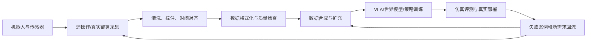

# Embodied data synthesis — research survey (cleaned)

> Migrated from the local survey. Absolute host paths replaced with `` / `` / `` placeholders.
> Canonical narrative for slides remains `docs/presentation-source.md`.

# 具身智能数据合成方法调研

> 研究锚点：具身智能数据合成方法，而不是单独介绍 DreamGen。
>
> 核心判断：具身智能数据合成的目标不是简单增加视频数量，而是围绕视觉、状态、语言、动作、时间五类数据契约，补齐真实数据的覆盖、监督和成本缺口，并最终改善 VLA 的训练与泛化。

## 0. 阅读范围与证据边界

本文融合了本地已有的 DreamGen、GR00T N1、WAM 和 Cosmos-Predict2 调研资料，以及已经跑通的 Cosmos action-conditioned Bridge 单条推理实验。

关键本地资料：

- `$WORKSPACE/01_Research\DreamGen-Brief.md`
- `$WORKSPACE/01_Research\GR00T-N1.md`
- `$WORKSPACE/01_Research\dreamgen-code.md`
- `$WORKSPACE/DreamGen-GR00T-and-Three-WAM-正式汇报-二版完整稿.md`
- `$TEMP/<handoff>`

本文区分四种证据：

| 标记 | 含义 |
|---|---|
| 官方/论文 | 来自官方 README、代码、论文或数据卡，可作为方法事实 |
| 代码确认 | 在当前仓库代码、配置或运行日志中确认 |
| 工程实测 | 本地或远程实际跑通的操作和输出 |
| 待验证 | 合理推断、公开材料未给出，或尚未完成下游实验 |

特别注意：126 条 MP4 生成完成不等于任务成功；IDM 写回动作不等于真实动作；GR00T 20K 微调完成不等于策略收益；Bridge test/13 跑通不等于 GR1 或其他 embodiment 已验证。

## 1. 什么是具身智能数据合成

### 1.1 从“数据增强”到“轨迹生成”

普通视觉数据增强通常只改变图片的颜色、裁剪、尺度或噪声，不改变样本的语义和标签。具身智能数据合成要生成的是一个随时间变化的交互过程：机器人看到了什么、处于什么状态、接收到什么任务、执行了什么动作，以及这些信息是否在时间轴上互相对应。

一条可训练的具身轨迹可以抽象为：

```text
轨迹 = {视觉观测, 本体状态, 语言任务, 动作序列, 时间索引, 元数据}
```

数据合成可以只生成其中一部分，也可以生成完整轨迹：

| 生成对象 | 例子 | 能否直接作为机器人动作监督 |
|---|---|---|
| 图像/视频 | 文本或首帧生成视频 | 通常不能 |
| 动作序列 | 动作扩散模型、轨迹优化 | 需要对应视觉和状态 |
| 仿真轨迹 | 仿真器执行脚本或示范 | 通常可以 |
| 带动作条件的视频 | 首帧 + 真实动作生成未来视频 | 动作可追溯，但需验证视频是否遵循动作 |
| 完整合成轨迹 | 视频、状态、语言、动作和时间全部对齐 | 可以进入 VLA 数据管线，但仍需质量门 |

因此，“生成了机器人视频”不能自动等价为“生成了机器人训练数据”。

### 1.2 为什么需要合成

真实机器人数据通常依赖人工遥操作或真实部署采集，存在四个共同瓶颈：

1. **成本高**：设备、场地、人员和安全成本叠加，采集速度受限。
2. **覆盖窄**：任务、物体、背景、光照、视角和失败情况很难充分覆盖。
3. **监督不完整**：人类视频常有丰富的视觉和语言信息，却没有机器人关节动作。
4. **本体依赖强**：换机器人、换相机或换动作接口，旧数据不一定能直接使用。

数据合成的价值不是替代全部真实数据，而是降低“每个新任务都重新遥操作采集”的边际成本，并补充真实数据难以覆盖的长尾场景。

### 1.3 数据合成需要解决的核心问题

一个合格的合成系统至少要解决：

- **覆盖问题**：新任务、新物体、新背景、新视角和失败状态是否被覆盖。
- **监督问题**：生成的视频是否有可信的动作、状态和时间标签。
- **一致性问题**：动作是否真的导致了视频中的变化，状态是否与动作相符。
- **本体问题**：动作字段、相机布局、坐标系、统计量和 embodiment tag 是否一致。
- **时序问题**：视频帧、timestamp、动作窗口和 episode 边界是否对齐。
- **下游问题**：合成数据进入 VLA 或 WAM 后是否带来收益，而不是污染训练分布。

## 2. 数据合成在具身智能工业链条中的位置



### 2.1 上游：数据从哪里来

- 真实机器人遥操作：动作和状态最可信，但成本高。
- 人类视频：任务和场景丰富，但通常没有机器人动作。
- 仿真器：状态和动作天然可读，规模大，但存在 sim2real gap。
- 现有机器人数据集：提供真实分布锚点和 embodiment 接口。

### 2.2 中游：数据合成做什么

数据合成位于“数据工程”和“模型训练”之间，主要承担三类工作：

1. 用仿真或轨迹重组扩大任务和场景规模。
2. 用视频世界模型生成真实分布中难以采集的视觉未来。
3. 将没有动作的视觉数据转换为潜在动作、伪动作或可执行动作监督。

### 2.3 下游：数据如何产生价值

合成数据最终要进入以下一个或多个环节：

- VLA 预训练或 embodiment-specific 后训练。
- IDM、动作解码器或策略模型训练。
- WAM 类视频到动作模型训练或微调。
- 仿真策略评测、数据筛选和失败重采样。
- 真实机器人部署前的覆盖测试。

工业闭环不是“采集 → 合成 → 训练”一次性流水线，而是“部署失败 → 找到覆盖缺口 → 生成针对性数据 → 再训练和验证”。

## 3. 具身智能数据是什么样子的

### 3.1 五类数据契约

| 契约 | 典型字段 | 作用 | 主要消费者 |
|---|---|---|---|
| 视觉 | RGB、深度、分割、点云、多视角、腕部相机 | 描述场景、物体和交互变化 | VLM、视觉编码器、世界模型 |
| 状态 | 关节位置/速度/力矩、末端位姿、夹爪、底盘、人体状态 | 描述机器人自身状态 | VLA 状态编码器、控制器 |
| 语言 | 任务指令、步骤、目标状态、失败描述 | 指定任务和语义目标 | VLM、任务条件模块 |
| 动作 | 关节、末端位姿、夹爪、全身、底盘速度 | 训练控制输出 | 动作头、IDM、控制器 |
| 时间 | timestamp、frame index、episode、频率、action chunk | 将多模态数据绑定到同一时刻 | 数据集、采样器、滑动窗口 |

除此之外，还需要元数据保证数据可解释：相机内外参、坐标系、机器人类型、字段映射、归一化统计量、任务标签和数据来源标签。

### 3.2 不同机器人对应的动作维度

动作维度不是固定的“7 维”。它由 embodiment 和控制接口决定：

| 本体类型 | 可能的动作字段 | 说明 |
|---|---|---|
| 单臂末端控制 | `dx, dy, dz, droll, dpitch, dyaw, gripper` | Bridge 等数据常见的 6D 末端增量加夹爪 |
| 单臂关节控制 | 每个 joint 的 position/velocity/torque | 维度等于关节数，可能包含夹爪关节 |
| 双臂 | `left_arm.*` + `right_arm.*` + 双夹爪 | 两套动作必须分别映射并保持同步 |
| 人形 | 双臂、躯干、头部、手指、腿、底盘 | 全身 DoF 很高，通常需要字段分组和 mask |
| 移动操作 | 机械臂动作 + `base_x/base_y/base_yaw` 或速度 | 需要同时处理操作和移动时序 |
| 人类视频 | 手部/人体姿态或潜在动作 | 通常不是机器人控制空间，需 retargeting |

状态和动作也不一定采用同一种表示。例如状态可能是绝对关节位置，动作可能是相对位姿增量；旋转还可能使用 Euler、axis-angle 或 6D rotation。没有明确的字段切片、坐标系和控制语义，模型无法正确解释向量；当训练管线采用归一化时，还必须使用与数据版本匹配的统计量。GR00T 的 `stats.json` 并非所有加载路径都强制要求，但 `modality.json` 是其 LeRobot 扩展的关键接口。

几个公开接口可以帮助理解这种差异：

| 数据/模型 | 官方示例中的接口 | 说明 |
|---|---|---|
| RT-X | 7D 标准动作：末端 `x,y,z,roll,pitch,yaw` + gripper | 便于跨机器人混合，但统一字段不等于统一动力学 |
| LIBERO / GR00T 示例 | 8D state、7D action，含主视角和腕部视角 | action 是 3D 平移、3D 旋转和夹爪 |
| DROID / GR00T 示例 | 17D state/action：9D EEF 表示、1D gripper、7D joints | 同时保存外部和腕部相机；具体训练可选择字段子集 |
| Octo 默认配置 | 最大 7D action、4-step action chunk、2 帧观察历史 | 说明动作维度之外还要定义 horizon 和 observation history |
| GR-1 人形 | 双臂、双手、腰、颈等关节字段，可附加双臂 EEF | 不能给“人形机器人”一个通用固定维度 |

来源：[Open X-Embodiment](https://robotics-transformer-x.github.io/) · [GR00T DROID modality](https://github.com/NVIDIA/Isaac-GR00T/blob/main/demo_data/droid_sample/meta/modality.json) · [GR00T LIBERO modality](https://github.com/NVIDIA/Isaac-GR00T/blob/main/demo_data/libero_demo/meta/modality.json) · [Octo](https://github.com/octo-models/octo) · [GR00T N1](https://arxiv.org/abs/2503.14734)

对于全身机器人，更稳妥的表达是：

```text
动作总维度 = Σ（被控制部件的 DoF × 该部件的动作表示） + 离散/连续执行器字段
```

手指、腿、腰和头是否进入 action 取决于任务与控制器。某些部件只作为 state 输入，不一定由当前策略输出。

### 3.3 数据格式：视频、Parquet、元数据

GR00T/DreamGen 使用 LeRobot 风格的数据组织；GR00T 还要求标准 LeRobot 之外的 `meta/modality.json` 来解释拼接向量中的语义区间：

```text
dataset/
├── meta/
│   ├── info.json
│   ├── episodes.jsonl
│   ├── tasks.jsonl
│   ├── modality.json
│   └── stats.json
├── data/chunk-000/*.parquet
└── videos/chunk-000/*.mp4
```

| 文件 | 保存什么 | 常见错误 |
|---|---|---|
| MP4 | 高维图像序列 | FPS、视角或首帧错误 |
| Parquet | 每个时间步的状态、动作、timestamp 和索引 | 动作维度、长度或时间戳不一致 |
| `tasks.jsonl` | 语言任务和任务索引 | 文本缺失、任务索引错位 |
| `episodes.jsonl` | episode 编号和长度 | 视频、Parquet 数量对不上 |
| `modality.json` | 字段、维度、动作分组和本体映射 | embodiment tag 不匹配 |
| `stats.json` | 归一化和反归一化统计量 | 生成动作尺度错误 |

时间对齐的基本约束是：给定 Parquet 中的 timestamp，数据加载器能够找到对应视频帧，并且动作窗口的起点和终点与相同 episode 对应。一个文件存在并不代表轨迹有效。

官方格式入口：[GR00T data preparation](https://github.com/NVIDIA/Isaac-GR00T/blob/main/getting_started/data_preparation.md) · [LeRobot](https://github.com/huggingface/lerobot)

### 3.4 数据分别有什么用

- 视觉学习“场景是什么”和“交互发生了什么”。
- 状态学习机器人“现在在哪里、以什么姿态运动”。
- 语言学习“要完成什么任务”。
- 动作学习“应该如何控制”。
- 时间信息学习“动作和变化的因果顺序”。
- 元数据让同一个模型能够区分不同 robot 的动作空间和统计量。

对 VLA 而言，目标通常是：

```text
(当前视觉, 语言, 本体状态, embodiment) -> 未来动作块
```

对世界模型而言，目标通常是：

```text
(当前视觉, 语言或动作条件) -> 未来视觉
```

对 IDM 而言，目标通常是：

```text
(多时刻视觉变化, embodiment) -> 动作块或潜在动作
```

## 4. 具身智能数据合成方法谱系

本文不按项目名称平铺，而按三个问题分类：**环境从哪里来、动作监督从哪里来、最终产物是什么**。这三个问题决定了数据能否直接用于 VLA，而不是画面是否足够逼真。

### 4.1 先区分四个容易混淆的层级

| 层级 | 解决什么问题 | 典型项目 | 本身是否产生可训练动作 |
|---|---|---|---|
| 物理与传感器引擎 | 计算状态演化、接触和相机输出 | MuJoCo、SAPIEN、Isaac Sim | 不一定；动作仍需控制器、专家或遥操作产生 |
| 场景与任务生成 | 生成资产、布局、任务定义和成功条件 | LIBERO、RoboCasa365、GenSim2、Genie Sim | 不一定；任务代码不等于成功轨迹 |
| 轨迹生成 | 让专家、规划器、源示范或策略在环境中执行 | MimicGen、DexMimicGen、RoboTwin 2.0、InternDataEngine | 通常可以，动作与状态来自同一 rollout |
| 神经轨迹与世界模型 | 生成未来视觉、潜在动作或动作条件结果 | DreamGen、Cosmos action-conditioned、WAM | 取决于动作来源；视频本身不等于动作监督 |

这一拆分很重要。Isaac Sim、SAPIEN 和 MuJoCo 是底座，不是自动生成成功机器人轨迹的完整方案；LIBERO 可以程序化生成任务，但其公开演示主要来自人类遥操作；真正决定动作标签的是专家控制器、规划器、示范变换、策略 rollout、IDM 或已知真实动作。

### 4.2 方法 A：仿真专家轨迹与示范重组

**典型系统**：MimicGen、DexMimicGen、RoboTwin 2.0、RoboCasa365、InternDataEngine；底层通常由 MuJoCo、SAPIEN 或 Isaac Sim 提供物理环境。

**基本方案**：

```text
少量示范/任务代码/规划器
        ↓
分段、坐标变换、场景和初始状态随机化
        ↓
在仿真器中执行，而不是只改离线文件
        ↓
同步导出 RGB/深度/状态/动作/接触/成功标志
        ↓
成功过滤、失败轨迹分流、格式转换
```

MimicGen 的关键不是“复制视频”，而是将源示范按子任务切分，将 waypoint trajectory 变换到新的对象初态并在仿真器中重新执行。论文实验由约 200 条人类示范生成 18 个任务的 50K+ 示范；当前公开仓库数据是 12 个任务的 48K+，两者是不同口径，不能混写。DexMimicGen 将同一思想扩展到双臂和多指手，论文从 60 条源示范生成约 21K 条双臂灵巧操作示范。[MimicGen 论文](https://arxiv.org/abs/2310.17596) · [生成机制](https://mimicgen.github.io/docs/modules/datagen.html) · [DexMimicGen](https://arxiv.org/abs/2410.24185)

RoboTwin 2.0 进一步把 MLLM 生成任务级执行代码、simulation-in-the-loop 修正、双臂专家执行和五轴域随机化串在一起；当前官方仓库提供 100K+ 轨迹以及 LeRobot v2.1/v3 转换。InternData-A1/InternDataEngine 则代表更近期的全栈仿真数据引擎：论文与官方仓库报告 630K+ 轨迹、7,433 小时、4 种 embodiment，并把 planning、rendering、storage 解耦。后者的规模和收益仍主要是作者报告，应保留“尚待独立复现”的边界。[RoboTwin 2.0](https://arxiv.org/abs/2506.18088) · [RoboTwin 仓库](https://github.com/RoboTwin-Platform/RoboTwin) · [InternData-A1](https://arxiv.org/abs/2511.16651) · [InternDataEngine](https://github.com/InternRobotics/InternDataEngine)

**解决的问题**：低成本获得带状态和动作的完整轨迹，扩大初始状态、对象、场景、语言和任务组合。

**优势**：动作、状态和时间戳由仿真器直接产生；容易获得失败标签和接触状态；适合大规模预训练。

**风险**：视觉域、摩擦、软体和灵巧接触与真实世界不一致；示范重组无法自然突破源技能原语；专家和成功判定会使数据偏向“容易成功”的模式；使用 privileged simulator state 训练出的管线未必能在真实部署复现。

**评价**：动作 replay 能否重现状态和画面、仿真任务成功率、接触与关节约束、随机化覆盖，以及与少量真实数据混合后的真实任务成功率。

**是否可直接训练 VLA**：轨迹监督通常完整，但仍需转换 schema、语言标签、相机和动作语义，并处理 sim-to-real gap。

### 4.3 方法 B：程序化或生成式场景、任务和资产

**典型系统**：LIBERO、RoboCasa365、GenSim/GenSim2、RoboGen、Genie Sim 3.0。

这条路线首先生成“世界和任务”，再调用规划器、RL solver、专家代码或遥操作产生动作：

```text
自然语言/任务模板/资产库
        ↓
LLM/MLLM 生成场景、任务定义、成功条件或执行代码
        ↓
仿真器编译与 simulation-in-the-loop 检查
        ↓
规划器/专家/策略执行并收集轨迹
        ↓
成功过滤、域随机化、数据导出
```

RoboCasa365 当前覆盖 365 个厨房任务、2,500+ 厨房和 3,200+ 对象；官方仓库给出的数据口径是 600+ 小时人类示范和 1,600+ 小时自动轨迹。GenSim2 使用多模态/推理 LLM 生成仿真任务代码，再由 planning 或 RL solver 产生 demonstration，关键边界是“LLM 生成任务/代码，不是凭文本直接生成可信关节动作”。LIBERO 更适合作为程序化任务和分布移位 benchmark，而不是自动动作轨迹生成器。[RoboCasa](https://robocasa.ai/) · [GenSim2](https://arxiv.org/abs/2410.03645) · [LIBERO](https://arxiv.org/abs/2306.03310) · [RoboGen](https://arxiv.org/abs/2311.01455)

Genie Sim 3.0 将 3D 重建、视觉生成、自然语言场景配置、自动数据编程和 VLM 评价组合为平台。官方当前报告 10K+ 小时合成数据、200+ 移动操作任务和 100K+ 评价场景；这些是快速演进项目的作者口径，适合作为前沿方向，不应直接当成行业通用效果。[Genie Sim 3.0](https://arxiv.org/abs/2601.02078) · [官方仓库](https://github.com/AgibotTech/genie_sim)

**解决的问题**：人工搭建环境和编写任务的速度跟不上模型需要；任务、对象、场景和语言覆盖不足。

**优势**：把扩展单位从“采一条轨迹”提升为“生成一个可反复采集的任务”；可同时生成成功条件和随机化配置。

**风险**：代码能运行不等于任务设计合理；求解器失败会造成任务选择偏差；资产几何、物理参数和成功条件可能与真实目标不符。

**是否可直接训练 VLA**：只有在后续专家或策略成功执行并同步导出动作、状态、视觉和时间信息后才可以。单独的场景、任务文本或渲染图不够。

### 4.4 方法 C：人类视频参与机器人学习

**典型方案**：Vid2Robot、Gen2Act、Dreamitate、GR00T N1/N1.5 的 latent action 与 FLARE；上游视频可以来自 Ego4D、Ego-Exo4D、EPIC-KITCHENS、HOI4D、Assembly-101 等。

人类视频有三种不同用法，不能统称为“转成机器人动作”：

1. 学习视觉、任务和可供性表征，不生成显式动作。
2. 估计手部/人体运动，再通过 retargeting 或 latent action 映射到机器人。
3. 把人类视频或生成的演示视频作为 policy 条件，让策略直接输出机器人动作。

Vid2Robot 用示范视频和当前机器人观测预测动作；Gen2Act 先生成新场景中的人类操作视频，再由 video-conditioned policy 执行；Dreamitate 也把生成的任务视频当作视觉计划。GR00T N1.5 的 FLARE 对齐未来视觉 latent，使无动作人类视频参与表征学习，并不要求把每段视频强行伪标为某个机器人关节动作。[Vid2Robot](https://arxiv.org/abs/2403.12943) · [Gen2Act](https://arxiv.org/abs/2409.16283) · [Dreamitate](https://arxiv.org/abs/2406.16862) · [GR00T N1.5](https://research.nvidia.com/labs/gear/gr00t-n1_5/)

**解决的问题**：任务语义、物体可供性和场景覆盖不足。

**优势**：规模和场景覆盖大；包含大量人类交互先验；适合学习语义和视觉表征。

**风险**：没有显式机器人动作；人体运动学与机器人运动学不同；遮挡、相机运动和视频剪辑会破坏时序。

**评价**：语义识别、物体交互预测、姿态估计误差、retargeting 可执行性，以及经过少量真实数据校准后的任务成功率。

**是否可直接训练 VLA**：通常不能直接作为标准机器人动作监督；可以用于表征预训练、视频条件策略，或在 retargeting/IDM 后作为带来源标记的弱监督。

### 4.5 方法 D：无动作条件的视频世界模型与 Neural Trajectories

**典型方案**：文本到视频、首帧到视频、图像到视频的 Cosmos-Predict2、DreamGen/GR00T-Dreams、RoboDream 等路径。

**基本方案**：

```text
场景首帧 + 语言指令
        ↓
视频世界模型
        ↓
机器人执行任务的未来视频
        ↓
IDM/潜在动作/人工标注
        ↓
带伪动作的训练轨迹
```

**解决的问题**：新场景、新背景、新物体和视觉未来覆盖不足。

**优势**：可以扩大视觉多样性；语言可控制任务意图；不需要每个新场景都重新遥操作。

**风险**：生成视频可能视觉上合理但动作不真实；动作监督需要额外恢复；长时一致性、接触和物理因果难保证。

**评价**：首帧一致性、任务语义一致性、时序和物理合理性、IDM 置信度、动作可重放性，以及下游 VLA 收益。

**是否可直接训练 VLA**：不能直接把 MP4 当作动作轨迹；需要 IDM、潜在动作或其他动作恢复环节，并保留伪标签来源。

DreamGen 的重要贡献是把这条链路做成 Neural Trajectories：先让世界模型适配目标机器人视频分布，再生成新视频，最后通过 IDM/latent action 恢复伪动作并用于 VLA 训练。论文评价同时包含指令遵循、物理一致性、人工检查和最终 policy success，而不是只报 FID/FVD。[DreamGen](https://arxiv.org/abs/2505.12705) · [GR00T-Dreams](https://github.com/NVIDIA/GR00T-Dreams)

### 4.6 方法 E：动作条件的视频世界模型

**典型方案**：Cosmos-Predict2 action-conditioned checkpoint，以及本次 Bridge test/13 实测。

**基本方案**：

```text
真实首帧 + 真实动作序列
        ↓
action-conditioned Video2World
        ↓
遵循动作条件的未来视频
        ↓
保留原动作作为监督
```

这里的动作不是 IDM 从生成视频中补出来的，而是作为模型输入的真实控制条件。它解决的是：在动作轨迹已知时，生成更多符合控制意图的视觉未来。

**优势**：动作监督有明确来源；相比无动作条件视频更容易保持控制意图；适合建立“动作 → 视觉后果”的世界模型。

**风险**：动作遵循不等于真实物理；输入动作、首帧和 embodiment 必须严格匹配；目前单条样例不能证明大规模下游收益。

**评价**：动作条件遵循度、接触事件一致性、视觉时间一致性、动作扰动敏感性、视频与真实轨迹的差异，以及使用原动作训练 VLA 后的收益。

**是否可直接训练 VLA**：可以保留输入侧的真实动作，但必须补齐状态、语言、时间和 embodiment 元数据，并验证输出视频确实遵循动作。动作作为条件不等于生成结果物理正确。

这条路线已经形成三个不同用途：

| 用途 | 代表项目 | 重点 |
|---|---|---|
| 视觉反事实扩增 | Cosmos Predict2 Action-Conditioned、EnerVerse-AC | 给定同一真实动作，改变场景、相机或视觉结果 |
| 神经策略评估器 | IRASim、iVideoGPT | 在世界模型中 rollout 策略动作，估计成功或失败 |
| 世界模型平台闭环 | Genie Envisioner / GE-Sim | 把视频预训练、动作解码和动作条件模拟器接在一起 |

IRASim 表明，训练和评价集中必须包含成功与失败 rollout，否则模型容易只会生成“乐观的成功未来”；EnerVerse-AC 进一步把动作和相机参数用于多视角生成。它们的定位更接近 neural simulator，不等同于已经生成可直接训练的完整数据集。[IRASim](https://arxiv.org/abs/2406.14540) · [EnerVerse-AC](https://arxiv.org/abs/2505.09723) · [Genie Envisioner](https://arxiv.org/abs/2508.05635) · [iVideoGPT](https://arxiv.org/abs/2405.15223)

### 4.7 方法 F：IDM、latent action 与动作恢复

这条路线的目标是把没有机器人动作的视频变成弱监督，而不是生成更多画面：

```text
当前帧 + 未来帧/视频片段
        ↓
IDM / latent-action encoder
        ↓
机器人动作、离散 latent 或连续 latent
        ↓
置信度筛选、仿真 replay 或下游训练
```

IDM 输出目标本体的显式动作；latent action 则只表达“发生了哪种变化”，未必具有可直接执行的物理单位。前者依赖同一 embodiment 的真实轨迹训练，后者更适合把异构视频纳入预训练。两者都属于伪标签，不应与真实控制日志混在同一字段而不记录 provenance。

RoboCurate 提供了值得补入的 2026 年质量门思路：将 IDM 动作在仿真器中回放，再比较生成视频与回放视频的运动表征，筛掉“画面合理但动作标签不一致”的 Neural Trajectory。这比单独使用 VLM 物理评分更接近动作可验证性。[RoboCurate](https://arxiv.org/abs/2602.18742)

**风险**：视角遮挡导致动作不可辨识；不同动作可能产生相似视频；坐标系、速度尺度和夹爪语义可能错误；长 horizon 的误差会积累。

**评价**：有真值时检查 MAE/方向/尺度；无真值时做仿真 replay、动作扰动敏感性、时序连续性、置信度校准和下游 policy success。

### 4.8 方法 G：世界-动作联合模型（WAM）

WAM 的目标不是先离线造好一个数据集，而是把视频世界建模能力放入策略学习或推理：

| 家族 | 世界模型在什么位置 | 最终送给机器人什么 | 本地对应项目 |
|---|---|---|---|
| 训练期视频辅助 | 视频 loss 塑造表征，推理主要输出动作 | action chunk | FastWAM |
| 视频与动作联合自回归 | 视频 latent 与动作共同滚动，维护因果状态 | action chunk，同时更新世界状态 | LingBot-VA |
| 世界模型特征条件动作 | 取视频模型中间特征给动作解码器，不必解码 RGB | action chunk | Mimic-Video / World2Action |
| 统一 video-action diffusion | 对视频和动作设置独立噪声时间，同一模型切换 policy、forward model、IDM | action、视频或二者 | UWM、UVA |
| 世界模型直接后训练为策略 | 把动作、未来状态或 value 编进世界模型 latent | action chunk / value | Cosmos Policy、DreamZero |

WAM 与 IDM 的方向相反：IDM 从已发生的视觉变化恢复过去动作，WAM 从当前观测预测未来动作，并可能同时预测未来视觉或其 latent。它们可以帮助选择、扩展或验证数据，但“策略模型在推理”不能直接等同于“已经合成并落盘了新数据集”。本地代码与论文核对见 `$WORKSPACE/01_Research\WAM-Three-Projects-Pipeline\README.md`。

UWM、UVA、Cosmos Policy 和 DreamZero 说明 2025–2026 年的研究正在从“先生成视频、再单独补动作”转向“联合预测视频、动作、状态甚至价值”。这是明显趋势，但还不能写成模块化链路已经被取代：这些项目很新，跨硬件动作语义、长时接触、失败校准和推理成本仍未解决。[UWM](https://arxiv.org/abs/2504.02792) · [UVA](https://arxiv.org/abs/2503.00200) · [Cosmos Policy](https://arxiv.org/abs/2601.16163) · [DreamZero](https://arxiv.org/abs/2602.15922)

### 4.9 方法 H：混合式数据闭环

现实工程中更可能采用：

```text
真实数据作为分布锚点
        +
仿真生成结构化大规模轨迹
        +
轨迹重组补充任务组合
        +
世界模型补充视觉未来和长尾场景
        +
IDM/动作模型补齐缺失监督
        ↓
质量筛选
        ↓
VLA/WAM 训练
        ↓
仿真和真实部署评测
        ↓
失败样本回流
```

它的核心不是把所有数据都变成同一种数据，而是保留每类数据的监督强度和来源标签，按用途混合使用。

### 4.10 前沿项目统一对比矩阵

| 项目 | 主要输入 | 生成/利用对象 | 动作监督来源 | 可否直接进入 VLA | 首要验收 |
|---|---|---|---|---|---|
| MimicGen | 少量带对象位姿的示范 | 变换、拼接并重执行的仿真轨迹 | 仿真执行的专家动作 | 可，需 schema 转换 | replay、任务成功、接触 |
| DexMimicGen | 少量双臂/灵巧手示范 | 双臂多指轨迹 | 仿真专家动作 | 可，需 DoF/坐标适配 | 双臂同步、手指接触、sim-to-real |
| RoboCasa365 | 厨房资产、任务、人类示范和自动专家 | 场景、任务、人工与自动轨迹 | 人类遥操作 + 自动轨迹工具 | 可，官方支持多类 policy/GR00T benchmark | 长程任务成功、域外厨房 |
| GenSim2 | 多模态任务描述 | 仿真任务代码和 demonstrations | planner / RL solver | 执行成功后可 | 代码可执行率、solver success |
| RoboTwin 2.0 | 对象库、MLLM 任务代码 | 双臂随机化轨迹 | 仿真专家 | 可转 LeRobot | 五轴扰动、少量真实混合收益 |
| InternData-A1 | 技能、场景、自动调度 | 多 embodiment 大规模轨迹 | 仿真专家/规划执行 | 数据已开放，需按模型适配 | 去重、任务成功、真实迁移 |
| 人类视频路线 | 人类/互联网视频 | 表征、视频计划或 retargeted 动作 | 无、latent 或映射动作 | 通常不能直接作真实动作监督 | 语义迁移、映射可执行性 |
| DreamGen | 首帧、语言、适配后世界模型 | 未来视频 + Neural Trajectory | IDM/latent-action 伪标签 | 质量门后混合使用 | 指令、物理、动作一致、policy gain |
| Cosmos action-conditioned | 首帧 + 已知动作 | 动作条件未来视频 | 输入侧真实动作 | 可保留原动作，仍需补全契约 | action following、接触、反事实敏感性 |
| WAM | 当前观测、状态、语言 | 未来动作及视频/latent 表征 | 真实或仿真轨迹训练 | 属于策略路径，不天然形成新数据集 | 闭环 success、延迟、鲁棒性 |

### 4.11 生成数据的六层质量门

| 层级 | 要回答的问题 | 通过示例 | 拒绝示例 |
|---|---|---|---|
| L0 格式契约 | 文件、shape、dtype、episode 是否完整 | MP4、Parquet、meta 数量一致 | 视频和表格数量不同 |
| L1 控制语义 | absolute/delta、EEF/joint、坐标系、旋转、gripper 是否正确 | 字段切片与控制器一致 | 7D shape 正确但旋转和夹爪语义相反 |
| L2 时间与可重放 | 视觉、状态、动作是否同一时刻且可执行 | replay 复现相近状态和接触 | timestamp 错位、动作领先/滞后 |
| L3 物理与任务 | 是否遵循指令、接触和动力学 | 物体被夹持后随夹爪运动且到达目标 | 穿模、漂浮、身份变化、假成功 |
| L4 覆盖、失败与来源 | 是否覆盖长尾、失败动作且可追溯 | scene/object/language/action/outcome 分层统计，保留 provenance | 大量重复、只保留容易成功模式、乐观偏置 |
| L5 下游价值 | 是否改善真实目标任务 | mixed data 在 held-out 与真实 rollout 有稳定增益 | loss 下降但闭环成功率下降 |

最低验收实验应包含 `real only`、`synthetic only`、`real + synthetic`、过滤前后和不同混合比例；同时报告平均值、方差和失败类型。SIMPLER 进一步说明仿真评价本身也要校准：除了 sim success，还要看成对 sim/real 结果的相关性和模型排序是否一致。[SIMPLER](https://arxiv.org/abs/2405.05941)

对于动作条件世界模型，还需要专门的 `action following` 测试：固定首帧，系统改变动作方向、幅度、夹爪开合和失败动作，观察视频是否产生相应而非“总是成功”的结果。DreamGen Bench、EWMBench 和 MiraBench 分别把指令/物理一致性、运动正确性和动作遵循/乐观偏置纳入评价；其共同结论是，视觉质量不能替代动作因果评价。[DreamGen](https://arxiv.org/abs/2505.12705) · [EWMBench](https://arxiv.org/abs/2505.09694) · [MiraBench](https://arxiv.org/abs/2605.29360)

## 5. 主流方案与未来发展

### 5.1 当前主流判断

当前更现实的主流不是“让一个生成模型替代全部采集”，而是组合路线：

1. 用少量真实数据建立视觉、动作和本体分布锚点。
2. 用仿真或轨迹重组获得大规模、结构化、带动作的轨迹。
3. 用世界模型补充视觉场景、任务长尾和动作后果。
4. 对缺失动作的数据使用 latent action、IDM 或 retargeting。
5. 用质量门和下游训练结果筛选合成数据。

GR00T N1 的数据金字塔是这一判断的直接例子：底层是大规模人类/互联网视频，中层是仿真轨迹和 Neural Trajectories，顶层是数量较少但控制语义最可靠的真实机器人轨迹。Open X-Embodiment、DROID 和 LeRobot 则说明，跨来源标准化本身就是合成数据进入 VLA 的前置基础设施，而不是合成完成后的文档工作。[GR00T N1](https://arxiv.org/abs/2503.14734) · [Open X-Embodiment](https://robotics-transformer-x.github.io/) · [DROID](https://droid-dataset.github.io/) · [LeRobot](https://github.com/huggingface/lerobot)

简化比较：

| 方法 | 规模 | 动作可信度 | 视觉真实性 | 主要用途 |
|---|---:|---:|---:|---|
| 真实轨迹 | 低 | 高 | 高 | 分布锚点、最终验证 |
| 仿真轨迹 | 高 | 高（仿真内） | 中 | 大规模结构化训练 |
| 轨迹重组 | 中 | 高 | 高 | 扩大任务组合 |
| 人类视频 | 很高 | 低/无 | 高 | 语义和视觉预训练 |
| 无动作世界模型 | 高 | 低 | 中到高 | 视觉覆盖，需动作恢复 |
| 动作条件世界模型 | 中到高 | 高（输入侧） | 中到高 | 动作后果建模 |
| 动作生成模型 | 中 | 取决于训练数据 | 取决于条件 | 策略和动作补全 |

需要保留两个反例，避免得出“数据越多越好”的结论：

- LIBERO 论文指出，朴素的监督预训练可能损害后续 lifelong learning，说明数据分布和训练方式比样本数量更重要。
- 生成视频、IDM 伪动作和训练 loss 下降都只是中间结果；没有 `real only / synthetic only / mixed` 的闭环 rollout，不能声称策略收益。

因此可以把当前成熟度概括为：**仿真专家轨迹仍是可直接训练数据的规模化主干；世界模型正在成为视觉覆盖、反事实生成和策略表征的重要增量；真实数据仍承担物理校准和最终验收。**

### 5.2 未来可能发展

以下是基于 2024–2026 项目演进的方向判断，不是已经普遍落地的行业事实：

1. **从生成未来到验证动作因果。** action-conditioned world model 会用于动作扰动、反事实比较和规划，但必须单独测试 action following，不能由视频质量代替。
2. **从 VLM 画面打分到 action-verified quality gate。** RoboCurate 一类方法把 IDM 动作回放进仿真，再核对视觉运动；评价对象从“像不像”转向“动作能否解释并复现”。
3. **从手写任务到生成式数据引擎。** RoboTwin 2.0、InternDataEngine、Genie Sim 3.0 把任务代码、资产、物理执行、调度、过滤和评价串成全栈，但新项目的规模与 sim-to-real 强结论仍需第三方复现。
4. **从统一长度到跨 embodiment 语义映射。** 固定 7D 或补零只能解决张量接口，未来需要显式记录坐标系、控制模式、运动学和可控部件，或学习可验证的 embodiment adapter。
5. **从静态混合到主动数据闭环。** VLA 的失败类型反向驱动新场景、动作扰动和困难样本生成，再由安全规则与真实 rollout 验收。
6. **从匿名合并到 provenance-aware sampling。** 真实、仿真、IDM 伪标签、latent action、动作条件视频应保留独立来源、置信度和版本，训练时分层采样而非无差别拼接。
7. **从像素世界模型到 WAM。** 视频 loss、世界 latent 或中间特征会更直接地参与动作预测；最终价值仍由闭环控制成功率、延迟与安全决定。

### 5.3 方法选择建议

| 目标 | 优先路线 | 原因 | 必须补的验证 |
|---|---|---|---|
| 快速获得大量可执行动作 | 仿真专家/示范重组 | 状态、动作和视觉同源 | sim-to-real、真实混合消融 |
| 扩任务和环境组合 | 任务/场景/代码生成 + solver | 扩的是可重复采集的任务 | 代码成功率、任务合理性、专家偏差 |
| 利用互联网或人类视频 | 表征学习、latent action、video-conditioned policy | 避免虚构真实机器人动作 | retarget/replay 或真实闭环成功 |
| 扩视觉长尾 | 无动作世界模型 + IDM/筛选 | 对新场景和语言控制灵活 | 伪动作置信度、物理、下游收益 |
| 保留真实动作并改变未来视觉 | action-conditioned world model | 动作 provenance 清楚 | action following、状态补全、反事实敏感性 |
| 直接提高策略对未来的建模 | WAM | 世界表征进入动作预测 | benchmark 与真实 rollout、推理延迟 |

## 6. 实测案例：DreamGen/GR00T 与 Cosmos action-conditioned Bridge

### 6.1 案例一：DreamGen + IDM + GR00T

DreamGen 的核心链路是：

```text
少量机器人视频后训练 Cosmos
        ↓
首帧 + 语言指令生成未来视频
        ↓
按 embodiment 拆分视角和整理 LeRobot 骨架
        ↓
IDM 从视觉变化恢复动作伪标签
        ↓
视频 + 语言 + 状态 + IDM 动作
        ↓
微调 GR00T N1
```

其中：

- Cosmos 负责“发生了什么”的视觉未来。
- IDM 负责从视觉变化推断“机器人做了什么”。
- LeRobot 负责把视频、动作、状态、语言和元数据统一起来。
- GR00T N1 将这些轨迹学习为跨 embodiment 的动作策略。

这条路线的关键边界是：IDM 动作属于伪标签，来源不是 Cosmos 的原生输出，也不是生成视频对应的真实控制日志。

### 6.2 案例二：Cosmos action-conditioned Bridge

本次采用的是“真实动作 + 首帧 → 未来视频”路线：

```text
Bridge test/13 首帧
        +
Bridge annotation 中的真实 action 序列
        ↓
Cosmos-Predict2-2B-Sample-Action-Conditioned
        ↓
未来视觉视频
```

运行条件：

- 模型：`nvidia/Cosmos-Predict2-2B-Sample-Action-Conditioned`
- 基础 tokenizer：`nvidia/Cosmos-Predict2-2B-Video2World/tokenizer/*`
- 设备：2 张 NVIDIA A100 80GB
- 推理：官方 `examples/video2world_action.py`
- 输入：Bridge test/13 的 `rgb.mp4` 和 `13.json`
- 参数：`num_conditional_frames=1`、`guidance=0`、`seed=0`

实测结果：

| 项目 | 结果 |
|---|---|
| 输入视频 | 24 帧，640×480，3 FPS |
| 输出视频 | 13 帧，640×480，4 FPS |
| 输出文件 | `bridge_test_13_official.mp4` |
| 动作来源 | Bridge annotation，真实动作条件 |
| 是否经过 IDM | 否 |
| 是否完成 GR00T 下游训练验证 | 否 |
| 验证范围 | Bridge test/13 单条样例 |

结果素材目录：

`$WORKSPACE/01_Research\Assets\DreamGen-GR00T-WAM-Report\page29_action_conditioned_bridge`

其中包含：

- `bridge_test_13_input.mp4`
- `bridge_test_13_official.mp4`
- `bridge_test_13_first_frame.png`
- `bridge_test_13_action_curve.png`
- `bridge_test_13_keyframes_contact_sheet.png`
- `bridge_test_13_annotation.json`
- `metrics.txt`

### 6.3 实测中暴露的工程问题

这次流程也验证了数据合成系统的工程风险：

1. action-conditioned checkpoint 依赖基础 Video2World tokenizer，不能只下载后训练 DiT。
2. 官方示例曾在 `--disable_prompt_refiner` 时仍强制加载 Reason1，已修复为按参数决定是否加载。
3. 容器缺少 `ffmpeg` 会导致模型加载完成后在读取视频时失败。
4. 示例 pipeline 用首帧构造输入时，必须补齐到 action-conditioned 配置要求的 13 帧窗口，否则会触发 temporal sampling 的长度错误。
5. Windows PowerShell 的中文路径重定向曾导致自动同步失败，已改为从脚本位置推导工作区路径。

这些不是论文结论，但说明“模型推理成功”之前还存在 checkpoint、媒体编解码、帧长、路径和数据契约等工程门槛。

### 6.4 该案例证明了什么，尚未证明什么

**已证明：**

- 官方 action-conditioned 模型可以在双卡 A100 上加载并推理。
- 真实 Bridge action 可以作为模型条件，生成非空未来视频。
- 输出视频和动作条件链路可以被整理为可展示的实验素材。

**尚未证明：**

- 生成视频中的每个接触事件都符合真实物理。
- 输出视频可以直接替代真实控制日志。
- 大规模生成数据一定提升 GR00T 或 WAM 的下游成功率。
- Bridge 的 7D 接口可以无修改迁移到 GR1、FastWAM、LingBot-VA 或 Mimic-Video。

## 7. 结论

1. 具身智能数据合成的核心对象是带控制语义、时间和本体约束的交互 episode，不是孤立图片或视频。
2. “环境生成、任务生成、轨迹生成、视频生成、动作恢复”是五个不同环节；只有五类数据契约完整且同步，结果才接近可训练轨迹。
3. 仿真专家轨迹目前仍是低成本扩大可靠动作监督的主干，示范重组、任务代码生成和域随机化是其中较成熟的工程方向。
4. 人类视频和无动作世界模型更擅长补语义、视觉和场景覆盖；IDM/latent action 可以补弱监督，但不能冒充真实动作。
5. 动作条件世界模型保留输入侧真实动作，降低了标签来源不明的问题；它仍需 action-following、接触物理和下游收益验证。
6. WAM 把世界建模能力放入策略训练或推理，代表“生成数据”和“学习控制”逐渐合流，但最终输出仍必须接受闭环成功率和安全评价。
7. 当前最可靠的工程路线是：**真实数据锚定分布，仿真规模化完整轨迹，生成模型补覆盖，来源感知的质量门筛选，真实 rollout 做最终裁决。**

## 附录 A：后续研究规划

### 第一阶段：继续补齐当前未覆盖的模态和本体

- 单独调研触觉、力/力矩和音频的采集与合成；当前公开主线仍以视觉操作为主。
- 单独调研腿式运动和全身控制数据，避免用 manipulation schema 外推 locomotion。
- 核对 2025–2026 新项目实际开放的数据子集、license 和版本，继续区分论文全量实验与公开 release。

### 第二阶段：建立统一评价实验

- 对同一任务比较真实、仿真、无动作视频和动作条件视频。
- 检查首帧一致性、动作遵循、接触事件、时序对齐和动作可执行性。
- 用同一 GR00T/WAM 配置比较加入合成数据前后的验证集和任务成功率。

### 第三阶段：验证下游价值

- 先做单 embodiment、小规模 smoke test。
- 再做真实数据与合成数据的混合比例消融。
- 最后测跨场景、跨物体、跨 embodiment 和真实部署迁移。

### 第四阶段：形成正式汇报

建议正式汇报按以下页面顺序组织：

1. 问题定义与核心结论
2. 工业链位置
3. 具身数据和动作维度科普
4. 方法谱系与统一对比矩阵
5. 评价标准与质量门
6. 主流路线和未来趋势
7. DreamGen/GR00T 案例
8. Cosmos action-conditioned Bridge 实测
9. 对 WAM 的接口意义
10. 总结与下一步实验

当前不应把“生成视频数量”作为主要结果，而应把“数据契约完整性、监督来源、动作遵循和下游控制收益”作为主线。

## 附录 B：主要官方来源索引

### 数据契约与 VLA 消费端

- [GR00T N1 论文](https://arxiv.org/abs/2503.14734)
- [Isaac-GR00T 数据准备](https://github.com/NVIDIA/Isaac-GR00T/blob/main/getting_started/data_preparation.md)
- [LeRobot](https://github.com/huggingface/lerobot)
- [Open X-Embodiment / RT-X](https://robotics-transformer-x.github.io/)
- [DROID](https://droid-dataset.github.io/)
- [Octo](https://arxiv.org/abs/2405.12213)
- [OpenVLA](https://arxiv.org/abs/2406.09246)

### 仿真、任务与轨迹生成

- [MimicGen](https://arxiv.org/abs/2310.17596) · [代码](https://github.com/NVlabs/mimicgen)
- [DexMimicGen](https://arxiv.org/abs/2410.24185)
- [RoboCasa365](https://robocasa.ai/) · [代码](https://github.com/robocasa/robocasa)
- [LIBERO](https://arxiv.org/abs/2306.03310) · [代码](https://github.com/Lifelong-Robot-Learning/LIBERO)
- [GenSim](https://arxiv.org/abs/2310.01361) · [GenSim2](https://arxiv.org/abs/2410.03645)
- [RoboGen](https://arxiv.org/abs/2311.01455)
- [RoboTwin 2.0](https://arxiv.org/abs/2506.18088) · [代码](https://github.com/RoboTwin-Platform/RoboTwin)
- [InternData-A1](https://arxiv.org/abs/2511.16651) · [InternDataEngine](https://github.com/InternRobotics/InternDataEngine)
- [Genie Sim 3.0](https://arxiv.org/abs/2601.02078) · [代码](https://github.com/AgibotTech/genie_sim)
- [Isaac Sim](https://developer.nvidia.com/isaac/sim) · [ManiSkill](https://github.com/haosulab/ManiSkill) · [SAPIEN](https://github.com/haosulab/SAPIEN) · [MuJoCo](https://github.com/google-deepmind/mujoco)

### 视频、世界模型、动作恢复与评价

- [DreamGen](https://arxiv.org/abs/2505.12705) · [GR00T-Dreams](https://github.com/NVIDIA/GR00T-Dreams)
- [Cosmos-Predict2](https://github.com/nvidia-cosmos/cosmos-predict2)
- [IRASim](https://arxiv.org/abs/2406.14540) · [EnerVerse-AC](https://arxiv.org/abs/2505.09723) · [Genie Envisioner](https://arxiv.org/abs/2508.05635)
- [UWM](https://arxiv.org/abs/2504.02792) · [UVA](https://arxiv.org/abs/2503.00200) · [Cosmos Policy](https://arxiv.org/abs/2601.16163) · [DreamZero](https://arxiv.org/abs/2602.15922)
- [Vid2Robot](https://arxiv.org/abs/2403.12943) · [Gen2Act](https://arxiv.org/abs/2409.16283) · [Dreamitate](https://arxiv.org/abs/2406.16862)
- [GR00T N1.5 / FLARE](https://research.nvidia.com/labs/gear/gr00t-n1_5/)
- [RoboCurate](https://arxiv.org/abs/2602.18742)
- [SIMPLER](https://arxiv.org/abs/2405.05941) · [EWMBench](https://arxiv.org/abs/2505.09694) · [MiraBench](https://arxiv.org/abs/2605.29360)

### 本地实测与代码证据

- `$WORKSPACE/04_Projects\GR00T-Dreams\README.md`
- `$WORKSPACE/04_Projects\GR00T-Dreams\cosmos-predict2\documentations\post-training_video2world_action.md`
- `$WORKSPACE/04_Projects\Isaac-GR00T\getting_started\data_preparation.md`
- `$WORKSPACE/01_Research\WAM-Three-Projects-Pipeline\README.md`
- `$WORKSPACE/01_Research\Assets\DreamGen-GR00T-WAM-Report\page29_action_conditioned_bridge`

> 访问与核对日期：2026-08-26。对 2025–2026 新项目的规模和收益，正文均按“论文/项目方报告”表述；未经过独立复现的结果不作为行业通用结论。

