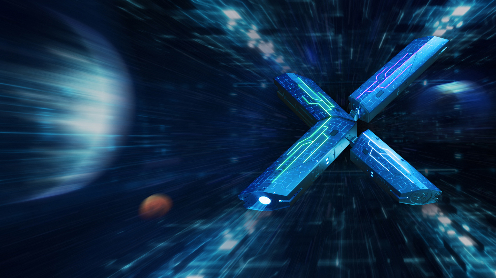
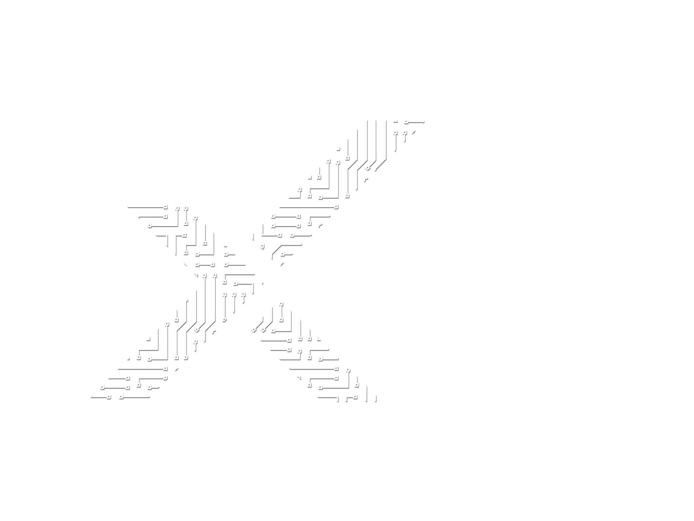

# 具身智能数据合成方法

具身智能数据合成的核心，不是单纯增加视频数量，而是补齐真实机器人数据难以覆盖的任务、场景和本体分布，并把这些变化重新封装成可验证、可训练、可部署回流的轨迹。

本文依据《具身智能数据合成方法-公司汇报-最终版》整理。正文保留可编辑的叙述、表格和从 PPTX 提取的原始图片；页面渲染图仅作为版式备份，统一放在 `assets/slide_*.png`，不嵌入正文。

## Part 1：问题定义与产业链位置

真实机器人数据同时受采集成本、设备数量、操作者经验和安全约束限制。一个任务可能只在少量房间、少量物体和单一本体上被反复记录，却很难覆盖长尾物体、遮挡、光照变化、罕见失败和跨机器人形态。数据合成因此不是替代真实数据，而是把真实数据中的控制结构扩展到更大的分布。

### 合成的对象是可训练轨迹

一段视频只能说明“画面发生了变化”，不能自动说明机器人执行了什么动作。可训练的具身轨迹至少要同时满足视觉、状态、语言、动作和时间五类契约：视觉描述环境与交互，状态描述本体自身，语言描述任务意图，动作定义策略要输出的控制量，时间把所有模态绑定到同一 episode 和控制频率。

真实数据仍然是物理和控制分布的锚点，但采集、标注、复现都昂贵；合成数据适合定向补充规模、变化和长尾，却必须通过动作一致性、字段完整性和下游训练质量门。只有通过验收的合成轨迹，才值得进入 VLA 训练集。

### 数据合成在产业链的中间位置

产业链可以看成一条闭环：机器人与传感器产生原始观测，遥操作或规划器产生示范，数据工程完成清洗、格式化和统计，数据合成扩展覆盖，随后进入 VLA 或世界模型训练，再经过仿真和真机验证；失败样本会反向指导新的采集与合成。数据合成位于数据工程和模型训练之间，但评价标准来自最终部署，而不是只来自生成器本身。

GR00T 将真实世界数据、合成数据、人类视频和 Neural Trajectories 视为不同来源。它们在动作监督、本体、坐标系和 schema 上并不天然兼容，因此合成流程需要把覆盖扩展重新带回统一的数据契约，而不是简单堆叠样本。

## Part 2：一条可训练的具身轨迹

具身数据不是“一段 MP4”，而是按时间对齐的多模态记录。视觉可以包括 RGB、深度、分割、点云和多视角；状态可以包括关节位置、速度、力矩、末端位姿、夹爪、底盘和人体状态；语言包括任务指令、步骤描述和目标状态；动作可以是关节、末端、夹爪、全身或移动底盘控制；时间字段包括 frame index、timestamp、episode、采样频率和动作 chunk。

不同机器人中 action 的含义不同。单臂常见为末端 6D 位姿加夹爪，或逐关节 position/velocity/torque；双臂需要分别表示左右臂并保持同步；移动操作还要加入底盘线速度和角速度；人形机器人需要同时描述双臂、躯干、头部、腿和手指等高维自由度。坐标系、控制频率、归一化统计量和 embodiment tag 必须一起保存，否则同一个数值在不同本体上可能代表完全不同的动作。

### 文件格式如何承载轨迹

LeRobot 数据格式中，MP4 保存观察画面，Parquet 保存状态、动作和时间索引，元数据定义任务、本体、字段映射、相机信息和归一化统计量。它们共同组成可被 DataLoader 读取的 episode；缺少任一部分，都可能让训练只能看到图像，或无法把预测动作还原为真实控制接口。

## Part 3：具身智能数据合成的方法谱系

比较方法时，同时看三个维度：环境是真实还是仿真，生成对象是画面、轨迹还是动作标签，动作监督来自真实控制、规划器、重定向估计还是模型伪标签。这样可以避免把“视频逼真”误认为“能够直接训练策略”。

### 仿真与程序化生成

Isaac Lab、MuJoCo、SAPIEN、RoboCasa、LIBERO 和 RoboSuite 可以从环境、任务和机器人配置出发，由脚本、规划器或专家策略 rollout，同时生成画面、状态和动作。域随机化能够快速扩大场景规模，动作监督也天然与仿真状态一致。主要风险是 sim2real gap、接触建模和视觉真实性不足，验收要看任务成功率、碰撞率、动作可执行性和真机迁移表现。

### 真实轨迹重组与示范扩增

MimicGen 把一条真实或仿真示范切分为可复用的子任务，再依据对象相对位姿在新场景中变换、拼接和回放。输出仍然是带状态和动作的完整轨迹，监督来自原示范的重定向，因此通常可以直接进入 VLA。回放失败、碰撞、物体穿透或时序断裂必须筛除；覆盖空间受原始示范和重定向质量限制。

### 人类视频与互联网视频转具身数据

这类方法从人类或互联网视频中做姿态估计、对象跟踪、3D/接触推断，再通过 retargeting、优化和语言步骤补全生成机器人候选轨迹。它能带来远大于机器人日志的任务与场景覆盖，但遮挡会造成姿态歧义，人的动作空间也不等价于机器人的控制空间。候选轨迹必须在仿真或真机中回放，检查碰撞、可达性、接触和任务结果。

### 无动作条件的视频世界模型

DreamGen 等文本/首帧到视频模型回答的是“接下来可能发生什么”。输入通常是任务文本、首帧和初始场景，输出是视觉未来，不直接产生关节动作。它适合扩展视觉变化和长尾环境，但动作监督缺失；若要用于 VLA，必须额外使用 IDM 或其他逆动力学模型从视频补伪标签。因此生成视频本身不能等价为完整机器人轨迹。

### 动作条件的视频世界模型

动作条件模型回答的是“执行这组动作后会看到什么”。输入为首帧和真实或规划 action，Action Conditioner 将动作注入 Cosmos Predict2，输出未来视频；动作监督来自外部控制序列，而不是模型从视频中猜出来。评价重点是动作遵循、物体运动、接触关系和长时一致性。它能保持控制意图，但仍需检查视频是否忠实反映动作。

## Part 4：从生成视频到 VLA 的工程验证

### DreamGen：IDM 把视觉变化转回动作

DreamGen 链路以首帧和任务指令生成视频，再由 IDM 接收多时刻视觉条件和 embodiment 信息，预测 16-step action chunk。后处理包括反归一化、字段恢复和滑动窗口平均，最后把动作写回 LeRobot episode。这里的动作是模型伪标签，不是真实控制日志，所以需要单独验证本体适配、动作范围、平滑性以及动作与视觉变化的一致性。

工程闭环可以概括为：首帧与指令 → Cosmos/DreamGen 视频 → IDM 伪动作 → LeRobot 轨迹 → GR00T 数据加载与微调。五类契约必须贯通到训练加载，单纯增加视频数并不能证明数据价值。

### GR00T：VLA 如何消费轨迹

GR00T N1 将视觉和语言编码为任务语义，将状态和 embodiment tag 作为动作语义的约束，再由动作头输出可执行的 action chunk。训练样本需要让观测、语言、状态、动作和时间严格对应；推理时模型根据当前观测滚动执行动作块，并持续接收新的观测。

GR00T 的数据层可以混合真实机器人轨迹、仿真轨迹、人类视频和 Neural Trajectories，但每一类数据的监督强度不同。真实轨迹负责校准控制分布，仿真负责结构化规模，生成视频负责扩展视觉覆盖；最终仍要用 rollout 成功率、鲁棒性和泛化评估，而不能只看 loss 或图像质量。

### DreamGen 工程证据

当前工程已贯通“视频生成—动作恢复—轨迹封装—VLA 微调”：`.data_idm` 进入 DataConfig 和 DataLoader，随后由 GR00T-N1-2B 读取。已验证的边界是数据能够完成格式转换、训练加载和梯度更新；尚未证明合成轨迹优于真实或仿真数据，也没有把单条任务结果外推为整体质量结论。

实测记录中，文本条件链路生成了 126 条视频并形成对应 IDM episode；GR00T 训练跑到 20k steps，说明数据可加载、梯度可更新、训练过程可持续。后续必须补充同基线 rollout、任务成功率、鲁棒性和跨场景泛化，不能把 loss 下降当作控制收益。

### Cosmos action-conditioned Bridge

第二条链路直接使用 Bridge test/13 的首帧和真实 action 序列，调用 `Cosmos-Predict2-2B-Sample-Action-Conditioned` 生成未来视频。基础 tokenizer 为 `Cosmos-Predict2-2B-Video2World`，动作来自真实 annotation，不经过 IDM；双卡 A100 已跑通官方推理路径。

当前样本输入 24 帧、640×480、3 FPS，输出 13 帧、640×480、4 FPS。这个案例证明的是“真实动作条件下的视频生成”接口可以运行，不代表整体数据集质量，也不代表 GR00T、WAM 或真机成功率已经提升。后续展示应同时放首帧、动作曲线、生成关键帧和原始/生成视频对比。

### WAM：动作预测与 IDM 的区别

IDM 的方向是“未来视觉 → 动作”：它为没有动作标签的视频补回伪监督；WAM 的方向是“当前视觉或世界表征 → 动作”：它把视频表征直接解码为控制输出。FastWAM 侧重训练期视频表征、推理期直接动作；LingBot-VA 联合视觉、语言和状态，接口风险集中在状态字段和本体标签；Mimic-Video 使用 Cosmos 特征到动作解码。三者都需要先核对帧数、特征层、动作窗口、统计量和 embodiment schema，再判断 DreamGen 轨迹能否接入。

WAM 可以成为合成数据的潜在消费端，但“能读取数据”与“能够从合成数据获益”是两件事。最低限度的验证顺序是：加载 schema → 对齐输入输出维度 → 检查动作误差 → 仿真或真机 rollout → 与真实数据基线比较。

更完整的横向比较见 [`method-comparison.md`](method-comparison.md)；IDM 与 WAM 的输入、输出和证据边界见 [`idm-wam-interface.md`](idm-wam-interface.md)。

## 方法选择与质量门

| 方法 | 动作监督来源 | 可直接训练 VLA | 主要价值 | 主要风险 |
| --- | --- | --- | --- | --- |
| 仿真/专家 rollout | 模拟器或控制器 | 是 | 规模与结构化动作 | sim2real gap |
| MimicGen | 示范重定向 | 是 | 任务组合 | 回放失败、组合空间有限 |
| 人类视频 | 姿态估计与 retargeting | 条件式 | 场景覆盖 | 控制空间不等价 |
| 无动作世界模型 | 无，需 IDM | 否 | 视觉未来 | 伪动作质量 |
| 动作条件世界模型 | 真实或规划动作 | 条件式 | 动作—视觉对齐 | 物理一致性 |
| IDM | 模型伪标签 | 条件式 | 补动作监督 | 误差累积 |
| WAM | 轨迹监督 | 是 | 直接动作预测 | 接口和本体依赖 |

合成数据至少要通过六道门：文件与解码、视觉一致性、时间对齐、动作与状态合法、训练加载、策略成功率。可读、帧数完整、物体运动连贯、frame/timestamp/episode 对齐、动作不越界且无 NaN、DataLoader 可加载，只说明“数据可用”；真正的“数据有效”还要看 rollout 成功率、鲁棒性和泛化是否达到目标。

## 主流路线与总结

当前主流不是单一模型，而是“真实轨迹为锚点 + 仿真补结构与规模 + 世界模型补视觉与长尾 + 自动质量门 + 下游闭环”。未来重点会转向 action-conditioned world model、数字孪生、跨 embodiment schema、失败驱动生成，以及由 VLA 反向提出数据采集和合成需求。评价也会从画面相似度转向下游控制成功率。

核心结论：合成的是可验证的具身轨迹，不只是视频；完整轨迹至少满足视觉、状态、语言、动作、时间五类契约；方法差异首先在生成对象和动作监督来源，而不是画面是否逼真；最可靠的工程路线是真实锚点、仿真扩结构、世界模型补视觉的混合方案；最终验收应看 rollout 成功率、鲁棒性和泛化，而不是只看 loss 或视频观感。

## 原始素材索引

下列原始图片均从最终 PPTX 的 `ppt/media/` 提取并保存在 `assets/`。正文已经按语义引用；以下未直接参与正文论述的素材也保留，便于后续编辑或重新排版。

